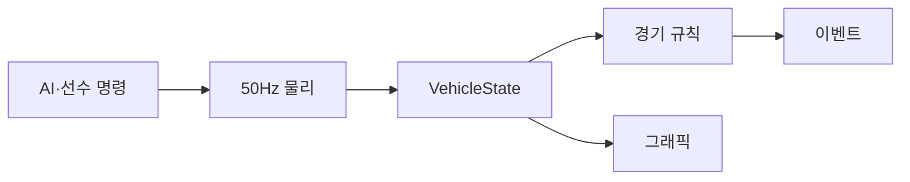
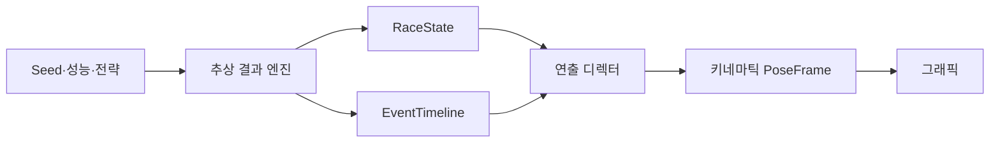

# 추상 레이스 시뮬레이션 설계

상태: **실험 설계 · 미구현**
기준일: **2026-08-03**
적용 범위: 결과 전용 퀄리파잉, 방송형 레이스, 즉시 결과, seed 결정성, 키네마틱 차량 연출

## 1. 문서의 위치와 결정

이 문서는 기존 50Hz 물리엔진을 즉시 교체하는 기준 문서가 아니다. 현재
`SIMULATION_FOUNDATION.md`의 물리 권위 계약은 `FULL` 모드에 그대로 적용한다.
추상 시뮬레이션은 현재 코드와 결과를 보존한 별도 실험 경로로 구현하고, 제품
승인 기준을 통과한 뒤에만 기본 모드 변경과 기존 물리 코드의 유지 범위를 결정한다.

이번 설계에서 채택하는 제품 방향은 다음과 같다.

- 연속 힘·슬립·요·열 적분 없이도 전체 레이스 결과와 관전 화면을 만들 수 있다.
- 결과 계산과 화면 연출을 분리한다. 렌더러는 결과를 결정하지 않는다.
- 차량은 자유 강체가 아니라 트랙 진행 좌표와 횡 오프셋을 사용하는 키네마틱
  객체로 표시한다.
- 차량·드라이버·서킷·타이어·전략 성능이 결과의 대부분을 결정하고, seed는
  자연스러운 편차와 사건 발생에만 사용한다.
- `BROADCAST`와 `INSTANT`는 동일한 추상 결과 엔진을 사용한다.
- 첫 실험에서는 현재 JSON 콘텐츠와 React/Three.js 렌더러를 재사용한다.
  Godot 이식은 추상 엔진의 결과·연출 계약을 검증한 뒤 진행한다.

## 2. 목표와 비목표

### 2.1 목표

- 20대 퀄리파잉과 레이스를 1x/2x/5x에서 안정적으로 진행한다.
- 렌더링을 끄면 같은 입력과 seed로 결과를 즉시 계산한다.
- 추월, 방어, 락업, run-wide, 접촉, 스핀, 정지, 리타이어, 피트와 SC를 화면에
  설명 가능하게 표현한다.
- 출력, 브레이크, 공력, 기계적 그립, 트랙션, 냉각과 신뢰성 업그레이드가
  섹터 페이스와 사건 확률에 일관되게 반영된다.
- 같은 seed, 콘텐츠 버전과 명령 로그에서 같은 논리 결과와 이벤트 타임라인을
  만든다.
- 미래의 가상 오픈휠 콘텐츠와 커리어 시뮬레이션에 재사용할 수 있는 경계를 만든다.

### 2.2 비목표

- 타이어 접촉 패치, 4륜 슬립, 서스펜션과 충격량을 재현하지 않는다.
- 연출용 차량 움직임을 실제 힘 또는 사고 원인의 증거로 사용하지 않는다.
- `FULL` 모드와 모든 pose·온도·접촉 시점이 동일하도록 만들지 않는다.
- 첫 단계에서 기존 물리 코드나 회귀 테스트를 삭제하지 않는다.
- seed만으로 차량 성능과 최종 결과를 무작위 추첨하지 않는다.

## 3. 실행 모드

| 모드 | 결과 엔진 | 차량 표시 | 주 용도 |
|---|---|---|---|
| `FULL` | 기존 50Hz 물리·AI | 물리 pose 재생 | 정밀 검증, 기존 기준선 |
| `ABSTRACT_BROADCAST` | 추상 시뮬레이션 | 키네마틱 pose와 이벤트 연출 | 일반 관전, 1x/2x/5x |
| `ABSTRACT_INSTANT` | `BROADCAST`와 동일 | 없음 | 퀄리파잉·레이스 즉시 결과 |

`ABSTRACT_BROADCAST`와 `ABSTRACT_INSTANT`의 같은 입력은 동일한 논리 결과를
내야 한다. 렌더링 여부가 난수 호출 순서, 전략, 사건 또는 최종 순위를 바꾸면
안 된다.

## 4. 현재 물리엔진과 추상 시뮬레이션의 차이

| 항목 | 현재 `FULL` 물리 | 추상 시뮬레이션 |
|---|---|---|
| 권위 원본 | 50Hz `VehicleState` | 논리 `RaceState`와 `EventTimeline` |
| 시간 단위 | 정확한 0.02초 | 기본 게임 시간 0.10초, 일부는 구간·사건 단위 |
| 이동 | 힘을 적분해 거리·속도·요 계산 | 섹터 페이스와 스플라인 진행률 계산 |
| 횡이동 | dynamic bicycle과 타이어 횡력 | 예약 corridor와 곡선 보간 |
| 가속·제동 | 출력·항력·그립·제동력 | 사전 계산된 구간 목표속도와 전환 곡선 |
| 타이어 | 축별 열·마모·슬라이드 에너지 | stint/구간 단위 grip·wear·temperature band |
| 충돌 | 회전 사각형 SAT와 swept collision | 조건 검증 후 선택된 사고 연출 템플릿 |
| 추월 | AI 명령 후 물리가 결과 확정 | 성능·공간·전술 모델이 결과 확정 |
| 락업 | 제동 요구가 그립 한계를 초과 | 위험 확률과 손실 모델이 사건 생성 |
| 사고 | 실제 접촉·상태 변화에서 파생 | 원인과 결과를 함께 가진 사건 생성 |
| 그래픽 | 물리 pose 보간 | 연출 디렉터가 pose 합성 |
| 배속 | 현재 1x/2x | 목표 1x/2x/5x, 선택적 10x/Instant |
| 장점 | 상태 일관성, 물리적 설명력 | 빠른 개발·실행, 쉬운 밸런스와 콘텐츠 확장 |
| 한계 | 높은 복잡도·CPU·보정 비용 | 연출 반복, 비물리적 장면과 결과 불일치 위험 |

### 4.1 가장 중요한 권위 차이

`FULL` 모드에서는 차량 상태가 먼저이고 사건은 상태에서 파생된다.



추상 모드에서는 결과 엔진이 논리 상태와 사건을 확정하고 연출기가 그 사건을
pose로 바꾼다.



추상 모드에서 `EventTimeline`은 물리 증거가 아니라 권위 있는 경기 서술이다.
따라서 API와 UI는 현재 물리 이벤트와 추상 이벤트의 `source_mode`를 구분해야 한다.

## 5. 추상 상태 모델

### 5.1 세션 상태

- `session_id`, `session_seed`, `content_version`, `ruleset_version`
- 세션 종류: 연습, Q1/Q2/Q3, 스프린트, 레이스
- 현재 게임 시간, 랩, 섹터와 플래그 상태
- 날씨, 노면 상태와 트랙 에볼루션
- 참가 차량, 순위, 간격과 피트 상태
- 예약된 이벤트와 처리된 이벤트의 안정적인 sequence

### 5.2 차량 논리 상태

- `driver_id`, `team_id`, 현재 순위
- `total_progress`, 현재 랩, 섹터, 다음 timing line
- 논리 속도와 앞차·뒤차 간격
- 타이어 compound, stint age, wear, temperature band
- 연료, 손상, 신뢰성 상태
- 페이스 모드, 공격성, 위험 허용도와 피트 요청
- 현재 maneuver, corridor, 사건 연출 상태
- 누적 랩·섹터 기록과 페널티

### 5.3 표시 상태

표시 상태는 논리 결과를 바꾸지 않는다.

- `track_distance_m` 또는 정규화된 `progress`
- 레이싱라인 기준 `lateral_offset_m`
- 표시 속도, 헤딩과 차체 흔들림
- `visual_state`: normal, attack, defend, lockup, contact, spin, stopped 등
- 연기, 파편, 타이어 자국, 라이트와 사운드 cue

## 6. Seed와 결정성

### 6.1 Seed의 역할

Seed는 다음에만 사용한다.

- 드라이버별 정상 랩 편차
- 공격·방어 시도 선택
- 락업·run-wide·접촉과 기계 결함
- 피트 작업 편차
- 날씨와 트랙 에볼루션 시나리오
- 동일 사건 안의 연출 변형 선택

차량의 기본 성능, 업그레이드 효과, 타이어 마모와 전략 비용은 seed로 결정하지
않는다.

### 6.2 독립 난수 스트림

하나의 전역 RNG를 공유하지 않는다. master seed에서 안정적인 이름과 식별자로
스트림을 파생한다.

```text
master_seed
├── session:weather
├── session:track_evolution
├── session:race_control
├── driver:{driver_id}:pace
├── driver:{driver_id}:mistake
├── team:{team_id}:pit
├── vehicle:{vehicle_id}:reliability
└── presentation:{event_id}
```

렌더러의 연출 선택은 `presentation` 스트림만 사용한다. 화면 효과를 하나 추가해도
경기 결과가 달라지지 않아야 한다.

### 6.3 재현 계약

다음 값이 같으면 논리 결과가 같아야 한다.

- master seed
- 콘텐츠·ruleset·추상 엔진 버전
- 초기 grid와 환경
- 사용자·AI 전략 명령 로그
- 차량 처리 순서와 시스템 처리 순서

리플레이에는 seed만 저장하지 않고 초기 snapshot, 명령 로그, 이벤트 타임라인,
구간별 상태 hash를 함께 저장한다.

## 7. 성능과 업그레이드 모델

### 7.1 차량 성능 축

첫 버전의 차량 성능은 다음 축으로 정규화한다.

- `power`: 직선 가속과 추월 closing speed
- `drag_efficiency`: 직선 최고속도와 연료 효율
- `high_speed_aero`: 고속 코너
- `medium_speed_aero`: 중속 코너
- `low_speed_grip`: 저속 코너
- `braking`: 제동 구간 페이스와 락업 여유
- `traction`: 스타트와 코너 탈출
- `tire_management`: 마모·온도·stint 안정성
- `cooling`: 타이어·브레이크·파워트레인 열 위험
- `reliability`: 결함 위험

### 7.2 트랙 구간 요구치

각 timing 구간은 성능 가중치를 가진다.

```text
segment_expected_time =
    base_segment_time
    × vehicle_factor(segment_weights)
    × driver_factor(segment_type)
    × tire_factor(compound, wear, temperature_band)
    × fuel_factor
    × traffic_factor
    × weather_factor
    + deterministic_variance(seed_stream)
```

예를 들어 직선 구간은 `power`와 `drag_efficiency`, 중제동 구간은 `braking`,
저속 탈출은 `traction`과 `low_speed_grip`, 고속 연속 코너는
`high_speed_aero`의 가중치가 높다.

### 7.3 업그레이드 반영

| 업그레이드 | 주요 페이스 효과 | 주요 사건 효과 |
|---|---|---|
| 출력 | 직선·가속·closing speed 향상 | 과열·신뢰성 비용 가능 |
| 드래그 효율 | 최고속도·연료 효율 향상 | 추월 기회 증가 |
| 프런트 에어로 | 진입·중고속 회두성 향상 | 언더스티어·run-wide 감소 |
| 리어 에어로 | 고속 안정·탈출 향상 | 오버스티어·traction loss 감소 |
| 브레이크 | 제동 구간 시간 단축 | 락업·fade 감소, 늦은 제동 창 증가 |
| 기계적 그립 | 저속·젖은 노면 향상 | 타이어 사용과 균형 변화 |
| 트랙션 | 스타트·코너 탈출 향상 | 휠스핀 감소 |
| 냉각 | 장기 stint 안정성 향상 | 과열·결함 감소 |
| 신뢰성 | 직접 랩타임 효과 없음 | 결함·리타이어 감소 |

업그레이드 효과는 단일 `overall_rating`으로 합치지 않는다. 서로 다른 서킷이
서로 다른 차를 유리하게 만들어야 한다.

## 8. 세션 계산

### 8.1 결과 전용 퀄리파잉

퀄리파잉은 한 번의 순위 추첨이 아니라 압축된 run 시뮬레이션으로 계산한다.

```text
세션 시작
→ 출차 시각과 타이어 준비
→ 아웃랩
→ 플라잉랩 S1/S2/S3
→ 교통·트랙 에볼루션·실수 반영
→ 피트 또는 다음 플라잉랩
→ Q1/Q2 탈락과 Q3 결과 확정
```

각 플라잉랩은 차량·드라이버·타이어·트랙 상태가 대부분을 결정하고, seed는
섹터별 정상 편차와 구체적인 실수 여부만 결정한다.

### 8.2 방송형 레이스

레이스는 추상 0.10초 틱을 기본으로 하되 비싼 평가는 사건과 timing 구간에서만
수행한다.

- 매 추상 틱: 논리 progress·간격과 예약 이벤트 진행
- timing 구간 통과: 페이스·타이어·연료 갱신
- 공격 창 진입: 추월 가능성과 corridor 평가
- 피트 결정 시: pit timeline 예약
- 위험 조건 충족 시: 실수·접촉·결함 평가
- 랩 종료: 기록, 전략과 경기 종료 검사

### 8.3 즉시 결과

`ABSTRACT_INSTANT`는 같은 틱과 사건을 화면 대기 없이 끝까지 실행한다. 계산을
단순화하거나 다른 확률 공식을 쓰지 않는다.

## 9. 추월과 방어

추월은 다음 단계로 결정한다.

1. 경기 규칙상 공격 가능 여부
2. 상대와의 간격과 closing speed
3. 남은 직선·제동 구간 거리
4. 두 차량과 여유 폭을 수용할 corridor 존재 여부
5. 공격·방어 드라이버 능력과 위험 허용도
6. 차량의 출력·브레이크·공력·타이어 차이
7. seed 기반 실행 편차 또는 실수
8. 결과와 시간 손실, 타이어·손상 효과 확정

결과 종류는 최소 다음을 지원한다.

- 공격 보류
- pull-out 뒤 철회
- 방어 성공
- 직선 추월 성공
- 제동 구간 추월 성공
- 나란히 다음 코너까지 지속
- run-wide 또는 경미한 접촉

렌더링은 결과에 맞춰 `approach → pull_out → overlap → pass/yield → rejoin`
타임라인을 재생한다.

## 10. 락업·사고·충돌

### 10.1 락업

락업 위험은 브레이크 성능, 타이어 상태, 제동 난이도, 드라이버 제동 능력,
공격 모드와 노면 상태로 계산한다. 사건은 다음 결과를 포함한다.

- 손실 시간과 속도 곡선
- 잠긴 바퀴 또는 축
- 연기와 타이어 자국 강도
- 횡 오프셋과 run-wide 여부
- 타이어 마모·flat spot 효과
- 후속 추월 기회 또는 접촉 가능성

### 10.2 접촉과 사고

추상 모드에서 충돌은 강체 solver 결과가 아니다. 발생 전에 현재 구간, 상대 위치,
예약 corridor와 뒤 차량 회피 가능성을 검증하고 다음 템플릿 중 하나를 선택한다.

- 경미한 측면 접촉
- 후방 접촉 후 스핀
- 프런트윙 손상
- 단독 스핀
- 자갈 정지
- 벽 접촉 후 정지
- 기계 결함 정지

템플릿은 원인, 논리 결과, 안전차 판단 정보와 연출 cue를 함께 가진다. 단순히
화면만 충돌시키고 논리 상태를 그대로 두지 않는다.

## 11. 키네마틱 렌더링

### 11.1 기본 pose

차량의 표시 위치는 트랙 스플라인과 횡 오프셋으로 계산한다.

```text
center = track_spline.sample(track_distance_m)
normal = track_spline.normal(track_distance_m)
world_position = center + normal × lateral_offset_m
heading = track_tangent_heading + maneuver_heading_offset
```

월드 좌표 사이를 직선으로 이동시키지 않는다. 특히 5x에서 코너 chord를 가로질러
순간이동하지 않도록 매 렌더 프레임 스플라인을 다시 샘플한다.

### 11.2 이벤트 연출

`EventTimeline` 항목은 다음 정보를 가진다.

- 안정적인 `event_id`, type, logical start/end time
- 관련 차량과 우선순위
- 트랙 progress 또는 구간
- 결과와 시간 손실
- 공격 방향, 심각도와 예약 corridor
- 최소 실제 표시 시간
- 카메라·사운드·파티클 cue

큰 사고나 마지막 랩 선두 싸움은 5x에서도 최소 표시 시간을 보장하거나 사용자
설정에 따라 1x/2x로 자동 감속할 수 있다.

### 11.3 겹침 방지

키네마틱 차량도 다음 안전 규칙을 지킨다.

- 동일 lane의 최소 종방향 간격
- 추월 전에 2-wide corridor 예약
- 같은 위치에 상충하는 연출 두 개를 동시에 예약하지 않음
- 사고 차량과 뒤 차량의 회피 lane 또는 감속 예약
- 연출 종료 시 논리 순위와 표시 순서를 다시 동기화

## 12. 배속

시뮬레이션 시간과 렌더 시간을 분리한다.

```text
simulation_delta = real_delta × speed_multiplier
render_delta = real_delta
```

| 배속 | 추상 계산 | UI | 연출 정책 |
|---|---|---|---|
| 1x | 10 logical ticks/s | 10~20Hz | 전체 연출 |
| 2x | 20 logical ticks/s | 10Hz | 대부분 유지 |
| 5x | 50 logical ticks/s | 5~10Hz | 중요 사건 중심, 최소 표시 시간 |
| 10x 후보 | 100 logical ticks/s | 2~5Hz | 로그·핵심 사건 중심 |
| Instant | 가능한 만큼 즉시 | 결과만 | 렌더링 없음 |

배속이 바뀌어도 logical tick 크기는 게임 시간 0.10초로 유지한다. 한 번에 큰
delta를 적분해 timing line, 피트 진입, 이벤트 시작·종료를 건너뛰지 않는다.

## 13. 현재 프로젝트에 붙이는 방법

### 13.1 코드 경계 제안

첫 Python 실험은 기존 `RaceEngine`을 수정해 분기를 늘리지 않고 별도 모듈로 만든다.

```text
backend/simulation/abstract/
├── engine.py              AbstractRaceEngine
├── state.py               논리 상태
├── clock.py               0.10초 fixed logical tick
├── rng.py                 독립 seed stream
├── performance.py         차량·드라이버·트랙 성능
├── qualifying.py          run/sector 퀄리파잉
├── strategy.py            타이어·피트·페이스
├── racecraft.py           공격·방어·추월 결과
├── incidents.py           실수·접촉·결함
├── timeline.py            EventTimeline
└── pose_synthesizer.py    렌더용 pose 생성
```

공용으로 재사용할 대상은 다음으로 제한한다.

- 데이터 loader와 검증된 콘텐츠 schema
- 트랙 스플라인, 폭, sector와 timing line
- 팀·드라이버·타이어 기본 사양
- API의 저빈도 대시보드와 결과 형태
- 렌더러 pose packet의 의미

기존 `RaceEngine`의 private 메서드를 추상 엔진에서 직접 호출하지 않는다.

### 13.2 세션 선택

`RaceSetupRequest`에 버전 있는 실행 모드를 추가한다.

```text
simulation_mode = FULL | ABSTRACT_BROADCAST | ABSTRACT_INSTANT
simulation_contract_version = 1
```

세션 factory가 모드에 맞는 엔진을 생성하고, 외부에는 공통 명령과 snapshot
인터페이스를 노출한다.

### 13.3 공통 출력 계약

두 엔진은 최소한 다음 의미를 공유한다.

- `race_info`
- 순위, 랩, GAP/INT, 타이어, 피트, 플래그
- pose frame: timestamp, driver_id, world position, heading
- 공개 이벤트와 결과

추상 모드에 존재하지 않는 슬립각·힘·축별 열수지 같은 정밀 텔레메트리는 가짜
값으로 채우지 않는다. 필드를 생략하거나 `source_mode=abstract`와 품질 플래그를
제공한다.

## 14. JSON, DB와 리플레이

- 차량·트랙·타이어·밸런스와 사건 템플릿은 버전 관리되는 JSON으로 유지한다.
- 사용자 커리어, 시즌, 업그레이드, 경기 결과와 save slot은 후속 SQLite 저장
  대상으로 분리한다.
- 50Hz pose 전체를 DB 행으로 저장하지 않는다.
- 추상 리플레이는 초기 snapshot, seed, 명령 로그, 이벤트 타임라인과 구간별 hash를
  압축 파일로 저장하고 DB에는 파일 경로·checksum·콘텐츠 버전만 기록한다.

## 15. 첫 프로토타입 범위

첫 구현은 전체 게임 교체가 아니라 다음 질문에 답하기 위한 수직 실험이다.

1. 기존 한 서킷의 20대가 5x에서도 자연스럽게 보이는가?
2. 출력·브레이크·공력 차이가 섹터와 추월 양상에 설명 가능하게 반영되는가?
3. 동일 seed에서 `BROADCAST`와 `INSTANT` 결과가 같은가?
4. 추월·락업·접촉·피트 각 한 종류를 물리 없이 납득 가능하게 연출할 수 있는가?
5. 현재 렌더러와 대시보드를 큰 재작성 없이 재사용할 수 있는가?

프로토타입에 포함할 범위:

- 단일 가상 또는 개발용 서킷
- 20대, 10랩
- 건조 고정 날씨
- 세 가지 타이어 역할
- 1x/2x/5x와 Instant
- 정상 추월, 실패한 공격, 락업, 경미한 접촉, 피트 1회
- SC와 복합 사고는 다음 단계

## 16. 테스트와 승인 기준

### 16.1 결정성

- 같은 seed·입력·버전으로 100회 실행 시 결과·이벤트 hash 동일
- 1x/2x/5x/Instant의 논리 결과와 이벤트 sequence 동일
- 렌더링 활성/비활성에 따라 결과가 바뀌지 않음
- 한 RNG 스트림의 호출 변경이 다른 시스템 결과를 바꾸지 않음

### 16.2 성능

- 20대 5x가 기준 장비에서 backlog 없이 동작
- Instant 20대 50랩을 사용자 대기 없이 완료하는 목표를 별도 측정해 확정
- 렌더링 60FPS 목표와 논리 UI 갱신 주기 분리
- 이벤트와 리플레이 버퍼가 랩 수에 따라 무한 증가하지 않음

### 16.3 경기 품질

- 차량 성능 순위를 뒤집을 만큼 seed 편차가 과도하지 않음
- 출력·브레이크·공력 업그레이드 A/B가 예상 구간에서 유의한 방향으로 작동
- 추월은 공간·간격·성능 조건 없이 발생하지 않음
- 같은 pair의 반복 공격과 사고가 cooldown 없이 연속 발생하지 않음
- 피트·랩·섹터 crossing을 5x에서 놓치지 않음

### 16.4 그래픽 품질

- 정상 주행 중 차체 겹침·순간이동·코너 chord 횡단 없음
- 추월 시작부터 재합류까지 pose 연속성 유지
- 락업·접촉 연출 뒤 논리 순위·간격과 표시가 일치
- 큰 사건의 최소 표시 시간과 자동 감속 설정 확인

## 17. 구현 단계와 중단 조건

### 단계 A — 결과 엔진

- 독립 seed stream, 성능 모델, 섹터 랩타임과 퀄리파잉 구현
- 렌더링 없이 결정성·업그레이드 A/B 테스트

### 단계 B — 단일 차량 pose 합성

- progress와 스플라인에서 1x/2x/5x 연속 pose 생성
- 현재 렌더러에 기존 pose 계약으로 연결

### 단계 C — 20대 교통과 추월

- 최소 간격, 2-wide corridor, 공격·방어 타임라인
- 순위와 표시 상태 동기화

### 단계 D — 락업·접촉·피트

- 논리 사건과 그래픽 템플릿 연결
- 10랩 결정성·성능·품질 승인

### 단계 E — 제품 결정

다음 중 하나를 선택한다.

- 추상 모드를 기본 제품 방향으로 채택하고 기존 물리를 검증 도구로 유지
- 두 모드를 함께 제공
- 품질이 부족하면 실험을 중단하고 기존 물리 기준으로 복귀

프로토타입이 실패해도 기존 `FULL` 엔진과 테스트가 영향을 받지 않아야 한다.
실험을 이유로 기존 물리 파일을 삭제하거나 회귀 기준을 완화하지 않는다.

## 18. 최종 요약

추상 시뮬레이션은 현재 물리엔진의 저정밀 버전이 아니라 다른 권위 모델이다.
현재 엔진은 차량 상태에서 결과를 만들고, 추상 엔진은 성능·전략·seed에서 논리
결과와 사건을 만든 뒤 pose를 합성한다.

제품 목표가 직접 조작하는 차량 시뮬레이터보다 팀 운영, 전략, 업그레이드와 관전
경험에 있다면 추상 방식은 개발 비용과 실행 비용을 크게 줄일 수 있다. 대신 결과
공식의 설명 가능성, 사건의 연속성, seed 결정성과 연출 품질을 새로운 핵심 승인
기준으로 삼아야 한다.
