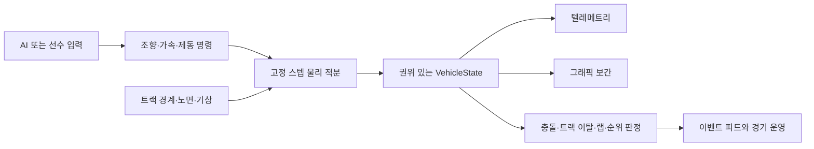

# 2D 레이스 시뮬레이션 기준 설계

상태: **현재 제품 기준**
기준일: 2026-07-22
적용 범위: 물리, 차량 상태, 텔레메트리, 그래픽, 이벤트, 트랙 데이터, 레이싱라인, AI 주행

이 문서는 앞으로의 구현 판단 기준이다. 기존 설계 문서와 충돌하는 경우 이 문서를 우선한다.

## 1. 확정된 제품 기준

### 1.1 파워트레인

- 기본 차량은 **750kW 내연기관 단일 동력원**을 사용한다.
- `engine_power_kw = 750.0`은 엔진 축의 명목 최대 출력이다.
- 구동계 효율은 별도 값으로 계산하며 750kW에 임의로 합산하지 않는다.
- 모든 팀은 첫 물리 기준선에서 동일한 750kW 엔진을 사용한다. 팀 성능 차이를 위해 엔진 출력을 바꾸지 않는다.
- 배터리 SOC, MGU-K, 회생제동, 전기 부스트, 2026 오버라이드 모드와 2026 파워유닛 규칙은 이번 기준에서 제외한다.
- 기존 DRS는 레거시 경기 규칙 옵션으로 분리할 수 있다. 2026 액티브 에어로와 혼합하지 않는다.

현재 `backend/data/teams.json`의 모든 기본 팀은 `750.0kW`로 정규화됐다. 이후 데이터 변경에서도 이 기준을 회귀 테스트로 유지한다.

### 1.2 차량 크기

- 물리 충돌 및 트랙 여유 폭 계산용 차체 폭: **1.900m**
- 휠베이스 기준: **최대 3.400m**
- 2D 충돌·렌더링용 임시 전체 길이: **5.000m**

FIA 2026 기술 규정 C2.3.1은 중심면에서 좌우 950mm의 폭 한계를, C2.3.3은 최대 3400mm 휠베이스를 규정한다. 규정에는 단일한 `전체 길이 5.0m` 값이 없으므로 5.0m는 현재 프로젝트의 충돌 외곽선 결정이지 FIA 공식 전체 길이가 아니다. 향후 앞·뒤 오버행 데이터가 정해지면 직사각형 하나 대신 전륜축, 후륜축, 앞·뒤 외곽선을 가진 차체 모델로 교체한다.

현재 코드는 `1.9m x 5.0m` 차체 외곽선을 충돌, 추월 여유 폭, 세이프티카 간격과 API에 이미 사용한다.

### 1.3 시뮬레이션 차원

- 현재 모든 트랙의 주행, 궤적, 충돌과 차량 동역학은 하나의 2D 평면에서 계산한다.
- 런타임 고도, 경사도와 뱅킹각은 모든 트랙에서 각각 `0m`, `0`, `0°`다. 원천 파일의 2.5D 채널은 향후 참고용 메타데이터일 뿐 현재 물리에 사용하지 않는다.
- 그래픽은 물리 상태의 표현일 뿐 물리 결과를 결정하지 않는다.

## 2. 가장 중요한 데이터 원칙

**차량 물리 상태가 유일한 원본이며 텔레메트리, 그래픽, 순위와 이벤트는 그 상태에서 파생한다.**

### 2.1 권위 있는 차량 상태

최소 상태는 다음 값을 가진다.

- 시뮬레이션 시간과 물리 프레임 번호
- 트랙 기준 종방향 거리와 월드 `x, y`
- 헤딩, 요레이트, 속도 벡터와 가속도 벡터
- 횡 오프셋, 슬립각, 조향각
- 스로틀, 브레이크, 기어, 엔진 RPM과 실제 전달 구동력
- 타이어 상태, 노면 접촉 상태와 그립 사용률
- 차체 충돌 외곽선, 접촉점과 충격량
- 피트·트랙·런오프 등 현재 주행 영역

텔레메트리에는 계산된 값과 보간된 값을 구분하는 `source` 또는 품질 플래그를 둔다.

### 2.2 금지할 지름길

- 추월 이벤트를 먼저 뽑고 차량 위치나 순위를 뒤에서 맞추지 않는다.
- 사고 이벤트를 뽑은 뒤 실제 충돌 없이 속도만 임의로 낮추지 않는다.
- 그래픽 차량 위치를 별도로 계산하지 않는다.
- 목표 랩타임을 맞추기 위해 진행률을 직접 증가시키지 않는다.
- AI의 `공격 성공` 확률이 물리적 추월 여부를 직접 결정하지 않는다.

난수는 드라이버의 판단 오차, 입력 지연, 기계 고장 발생 같은 원인에 사용할 수 있다. 난수 결과는 먼저 제어 명령이나 차량 상태를 바꾸고, 이벤트는 실제 상태 변화가 확인된 뒤 발생해야 한다.

### 2.3 시간축 기준

- 차량 물리는 `0.02초(50Hz)` 권위 스텝, AI 전술 판단은 `0.10초(10Hz)`, 로컬 궤적 정기 재계획은 `1.00초(1Hz)`로 역할을 분리한다. 피트·회피·추월 상태 전환은 정기 주기를 기다리지 않고 즉시 재계획할 수 있다.
- 화면 스냅샷은 실시간 `30Hz`로 보내며 직전 전송 이후의 50Hz 권위 pose 열을 포함한다. Pixi 캔버스는 이를 최대 `60FPS`로 보간한다.
- 세션 루프는 벽시계 기반 시뮬레이션 credit과 화면 전송 deadline을 분리한다.
- 지원 배속은 `1x/2x/3x`이며 같은 시뮬레이션 시간에는 같은 물리·AI 결과가 나와야 한다.
- 첫 기준은 50Hz 물리를 유지하되 충돌에는 연속 충돌 검사 또는 swept body 검사를 사용한다.
- 50Hz에서 타이어·요 동역학·접촉 안정성이 부족하다는 회귀 테스트 결과가 나오면 필요한 서브시스템만 100~200Hz substep으로 올린다.
- 화면은 물리 스냅샷 사이를 보간할 수 있지만 물리 상태를 되먹임하지 않는다.
- AI 난수 확률은 tick 횟수가 아니라 경과 시뮬레이션 시간으로 환산한다.

## 3. 현재 물리 모델의 위치

현재 구현은 트랙 진행 좌표의 종방향 힘 모델과 평면 dynamic bicycle model을 결합한다. 전·후축 슬립각과 횡력, 3.4m 휠베이스, 요 관성, 조향각, 차체 헤딩과 요레이트를 50Hz에서 적분하며 공력, 구동력, 제동력, 그립 한계와 차체 외곽선 충돌도 같은 권위 상태를 사용한다. 아직 하중 이동과 바퀴별 열·슬립률까지 계산하는 완전한 차량 동역학 모델은 아니다.

현실성 향상 순서는 다음과 같다.

1. **현재 기반 안정화**: 실제 이동 상태에서만 랩, 추월, 충돌, 이벤트를 확정한다.
2. **완료 — 2D bicycle model**: 전·후축 횡력, 요 관성, 조향각, 차체 헤딩과 요레이트를 상태로 적분한다.
3. **부분 완료 — 결합 타이어 한계**: 제동·가속·코너링이 동일한 마찰 원을 사용하며 락업·휠스핀과 힘 손실을 계산한다. 표면/코어 열 상태도 그립에 반영됐으며 다음으로 압력과 하중 이동을 더한다.
4. **부분 완료 — 열·질량 상태**: 타이어 표면/코어 온도와 연료 소모 질량은 실제 힘 한계에 반영됐다. 압력과 브레이크 열은 후속 단계다.
5. **평면 물리 완성**: 고도·경사·뱅크 없이 종·횡 힘, 궤적, 충돌과 AI 판단을 먼저 완성한다. 2.5D 확장은 이 기준이 안정된 뒤 별도 단계로 검토한다.

랩타임 일치만으로 물리 모델이 맞다고 판단하지 않는다. 속도, 제동점, 횡가속도, 스로틀 재개 지점과 타이어 사용률도 함께 검증한다.

## 4. 현재 트랙 데이터는 어디에서 왔는가

현재 등록된 5개 실제 서킷의 중심선과 피트레인은 모두 `backend/data/circuit_sources/*_osm_geo.json`에 저장된 **OpenStreetMap WGS84 좌표**다. 파일에는 `source=osm`, `license=ODbL`, `attribution=OpenStreetMap contributors`가 기록돼 있다. 원본을 로컬 미터로 투영한 뒤 공식 중심선 길이에 맞춰 스케일을 보정한다.

Red Bull Ring은 여기에 `TUMFTM/racetrack-database`의 `Spielberg.csv`를 추가로 정렬해 위성 영상 기반 좌·우 폭 64개 샘플을 사용한다. 공개 데이터가 제시하는 총 폭은 `10.181~13.191m`이며 평균은 `10.993m`다. 이는 FIA 정밀 측량값이 아니라 TUM이 위성 영상에서 추출한 추정치이므로 출처와 한계를 profile 및 calibration report에 함께 보존한다. 속도·스로틀·브레이크는 TracingInsights의 2025 Austrian GP 퀄리파잉 상위 5명 랩을 128개 진행률 샘플로 축약했다.

| 서킷 | OSM 원본 ID | 공식 길이 | OSM 원본 길이 | 중심선/피트 샘플 |
|---|---|---:|---:|---:|
| Bahrain | `osm:bahrain-gp` | 5,412m | 5,422.201m | 240 / 20 |
| Red Bull Ring | `osm:red-bull-ring-gp` | 4,318m | 4,305.205m | 249 / 32 |
| Silverstone | `osm:silverstone-gp` | 5,891m | 5,883.784m | 507 / 73 |
| Spa-Francorchamps | `osm:spa-francorchamps-gp` | 7,004m | 6,996.863m | 330 / 47 |
| Hungaroring | `osm:hungaroring-gp` | 4,381m | 4,369.160m | 430 / 67 |

현재 한계는 다음과 같다.

- Bahrain은 공식 폭 범위 `14–22m`와 T1 `22m` 제어점을 적용했고 Red Bull Ring은 TUM의 가변 폭 샘플을 적용했다. Silverstone·Spa·Hungaroring은 실제 좌우 폭 샘플이 없어 전 구간 기본 폭 12m를 사용한다.
- 정확한 트랙 경계, 연석, 런오프, 자갈, 잔디, 벽 데이터가 없다.
- Bahrain의 Copernicus GLO-30 기반 64개 고도·grade 표본은 출처 메타데이터로 보존하지만 런타임에서는 읽지 않는다. 모든 트랙의 물리와 텔레메트리는 평면값을 사용한다.
- 경사와 뱅크는 현재 범위에서 의도적으로 제외했다. 구간별 노면 마찰 지도와 배수 상태는 아직 없다.
- FIA 맵은 길이, 코너, DRS와 시설 위치 확인에 사용하지만 기계 판독 중심선 원본으로 사용하지 않는다.

### 4.1 현재 실제 랩 데이터 사용 방식

`backend/tools/calibrate_tracinginsights_lines.py`는 TracingInsights 2025 예선 텔레메트리에서 빠른 클린 랩을 고르고, 위치 채널을 평균·정렬해 OSM 중심선 기준의 64개 횡 오프셋 샘플로 저장한다. 이 값은 차량을 재생하는 경로가 아니라 물리 최적화의 **보정 기준 또는 prior**다.

현재 데이터 정리에서 확인된 사항:

- 각 서킷의 `physics_calibration`은 TracingInsights 자료를 출처로 기록한다.
- 자동 보정 도구의 명시적 대상은 Bahrain, Red Bull Ring, Silverstone, Hungaroring이다.
- Spa는 별도 보정 데이터가 있으나 출처 URL 표기가 다른 네 트랙과 달라 출처와 생성 절차를 다시 확인해야 한다.
- FastF1 위치 채널은 `X/Y/Z`를 0.1m 단위로 제공하지만, 문서상 서로 다른 랩을 겹칠 때 시간 정렬 오차가 약 ±10m일 수 있다. 실측 측량값으로 취급하지 않는다.

## 5. 추가로 사용할 수 있는 트랙·주행 데이터

| 소스 | 적합한 용도 | 한계와 정책 |
|---|---|---|
| OpenStreetMap | 중심선, 피트레인, 대략적 배치 | ODbL 표시와 데이터 배포 조건을 지킨다. 폭·연석·뱅크의 정밀 원본으로 보지 않는다. |
| FIA 이벤트 서킷 맵 | 공식 길이, 코너 번호, 출발·컨트롤 라인, DRS, 마셜 시설 | 공식 검증 자료다. `All rights reserved`인 PDF 도형을 좌표 데이터로 재배포하지 않는다. |
| TUMFTM racetrack-database | 미터 좌표 중심선, 좌·우 폭, 최소 곡률 라인, OSM 교차 검증 | 트랙별 품질 차이가 크다고 저장소가 명시한다. 직접 포함 전 LGPL-3.0 및 원천 데이터 조건을 확인한다. |
| TracingInsights / FastF1 | 실제 속도, 스로틀, 브레이크, 기어, RPM, 위치 경향과 빠른 랩 검증 | 비공식 데이터이며 보간·시간 정렬 오차가 있다. 원본 재배포 권한과 상표·데이터 이용 조건을 별도 검토한다. |
| OpenF1 | 2023년 이후 세션, 차량 채널, 대략적 위치, 경기 이벤트 교차 검증 | 약 3.7Hz 위치는 좌우 배치가 부족하다고 공식 문서가 명시한다. 레이싱라인 원본으로 부적합하다. |
| 서킷 운영사 CAD, 측량, LiDAR | 정확한 경계, 폭, 높이, 뱅크, 연석과 벽 | 가장 좋은 원본이지만 비용과 라이선스가 핵심이다. 계약상 게임 사용과 파생 데이터 배포를 확인한다. |
| 공개 DEM | 큰 고저차와 장거리 경사 초안 | 해상도가 연석·뱅크보다 훨씬 거칠다. 정밀 차량 물리의 단독 원본으로 사용하지 않는다. |

위성·항공 이미지는 눈으로 교차 검증하는 데 유용하지만, 사용 권한 없이 선을 추출해 프로젝트 데이터로 배포하지 않는다.

## 6. 새 트랙의 레이싱라인을 물리로 만들 수 있는가

**가능하다. 현재 코드에도 차량·타이어별 전역 궤적 최적화가 연결되어 있다.**

`backend/simulation/track_physics.py`의 `optimize_vehicle_trajectory()`는 중심선, 좌우 폭, 노면 경계, 차량과 타이어 사양으로 경로와 속도 프로파일을 평가한다. `build_vehicle_track_physics_profile()`은 차량별 결과를 캐시하고 레이스에 제공한다. 자동 테스트는 생성 라인이 경계 안에 있고, 연속적이고, 자기 교차가 없으며, 동일 물리 모델에서 중심선보다 빠른지 확인한다.

다만 현재 입력 품질에서는 “현재 모델 안에서의 최적선”이라고 표현해야 한다. 실제 최적선으로 승인하려면 다음 데이터가 필요하다.

- 구간별 좌·우 실제 폭과 주행 가능 경계
- 연석의 위치, 폭, 높이와 사용 가능 여부
- 런오프·잔디·자갈·벽의 마찰과 위험 비용
- 실제 주행 가능 경계와 표면별 그립. 고도·경사·뱅크는 현재 평면 기준의 승인 조건에서 제외한다.
- 차량별 공력, 타이어 마찰 한계와 제동·구동력
- 실제 빠른 랩의 속도·제동·스로틀·주행 위치

### 6.1 채택할 3단계 정책

1. **물리 우선**
   - 새 트랙의 중심선, 좌우 폭과 노면을 입력한다.
   - 최소 곡률 라인을 초기값으로 만들고 최소 랩타임 목적함수로 다시 최적화한다.
   - 차량과 타이어별 라인·속도 프로파일을 생성한다.
2. **실제 랩 검증·보정**
   - 복수의 빠른 클린 랩에서 제동점, 코너 최저 속도, 횡 위치와 출구 가속을 비교한다.
   - 한 선수의 습관을 정답으로 쓰지 않고 여러 선수·랩의 분포를 사용한다.
   - 차이가 나면 먼저 트랙 폭, 뱅크, 연석과 차량 파라미터가 잘못됐는지 확인한다.
3. **주행 데이터 기준선 사용**
   - 트랙 경계 데이터가 불충분하거나 실제 특수 연석 사용을 모델링할 수 없을 때만 측정 라인을 prior로 사용한다.
   - 측정 라인 그대로 차량을 고정하지 않고 안전 경계 안의 초기값·소프트 비용으로 넣는다.

이 방식이면 새 트랙을 추가할 때마다 선수가 직접 기준 랩을 달려야 하는 구조를 피할 수 있고, 실제 데이터가 생기면 물리 모델 자체를 개선할 수 있다.

### 6.2 새 트랙 자동 승인 테스트

모든 새 트랙은 다음 테스트를 통과해야 한다.

- 출처·라이선스·원본 식별자·취득일·변환 버전 필수
- 폐곡선, 주행 방향, 출발선과 공식 길이 검증
- 중심선 자기 교차 없음, 점 간격과 곡률 급변 제한
- 좌우 폭이 차체 반폭과 안전 여유보다 큼
- 피트 진입·출구 방향과 메인 트랙 연결 연속성
- 동일 입력에서 최적화 결과와 랩타임이 결정적임
- 레이싱라인 자기 교차 없음, 경계 침범 없음, 횡 이동률 제한
- 물리 예측에서 최적선이 중심선보다 빠름
- 단독 차량 반복 주행에서 NaN, 순간이동, 경계 이탈과 충돌 없음
- 서로 다른 연료·타이어·차량 사양에서 안전하게 다시 생성됨
- 실제 텔레메트리가 있으면 속도, 제동점, 최저 속도와 횡 위치 오차 보고서 생성
- 화면 회전·줌과 무관하게 물리 좌표, 그래픽과 텔레메트리 좌표가 일치

실제 랩타임 하나를 강제로 맞추는 상수는 승인 조건이 아니다. 먼저 여러 물리 채널의 오차를 보고하고, 트랙별 허용 오차는 원본 데이터의 정확도를 확인한 뒤 정한다.

## 7. 다른 레이싱 시뮬레이션의 구현 방식과 적용점

상용 게임은 전체 AI 내부 구조를 공개하지 않으므로 확인 가능한 공식 자료와 공개 구현을 기준으로 본다.

### 7.1 제작된 이상선·스플라인

Assetto Corsa 계열 자료에서는 트랙 노드와 AI 주행선 계산을 분리하고, Assetto Corsa EVO 공식 업데이트는 `ideal line`과 `pitlane spline`을 별도로 두며 피트 진입·출구 스플라인을 런타임에 이상선과 합치는 구조를 명시한다. 장점은 빠르고 안정적이라는 점이고, 단점은 차량·노면 변화에 맞춰 이상선을 다시 만들거나 힌트를 보정해야 한다는 점이다.

우리 프로젝트에는 피트라인, 세이프티카와 기본 주행 가능 통로의 안정화 방식으로 적합하다. 최종 레이싱라인을 손으로만 제작하는 방식은 채택하지 않는다.

### 7.2 물리 기반 오프라인 최적화

TUMFTM 공개 구현은 `x, y, 우측 폭, 좌측 폭` 트랙을 입력하고 최단 경로, 최소 곡률, 최소 시간, 파워트레인 포함 최소 시간 목적함수를 선택한다. 결과에는 경로 거리, 좌표, 헤딩, 곡률, 목표 속도와 가속도가 포함된다.

이 방식이 우리 전역 기준선에 가장 적합하다. 현재 구현도 같은 계열이며 앞으로 실제 폭, 마찰 지도와 뱅크를 추가하면 된다.

### 7.3 학습형 레이싱 드라이버

Gran Turismo Sophy는 모델 프리 심층 강화학습, 혼합 상황 훈련과 스포츠맨십 보상으로 속도와 다차량 전술을 함께 학습했다. 후보 정책도 랩타임만으로 고르지 않고 코스 이탈과 충돌을 포함한 Pareto 기준과 수작업 상황 테스트로 평가했다.

우리 AI도 최종적으로는 이런 평가 철학을 따라야 하지만, 지금 바로 종단간 강화학습으로 교체하면 물리 오류와 AI 오류를 분리하기 어렵다. 먼저 결정적 물리와 테스트 환경을 완성하고 학습형 정책은 전술·상대 대응 계층부터 도입한다.

### 7.4 권장 하이브리드 구조

- **오프라인 전역 최적화**: 차량·타이어·트랙별 기본 레이싱라인과 속도 프로파일
- **온라인 로컬 플래너**: 약 3~5초 구간에서 추월, 수비, 교통, 피트 진입 경로 생성
- **전술 AI**: 공격 여부, 위험도, 타이어·연료·날씨와 장기 전략 판단
- **저수준 제어기**: 선택한 경로를 조향·스로틀·브레이크 명령으로 추종
- **물리 엔진**: 모든 차량에 같은 법칙을 적용하고 실제 결과를 확정

AI는 `추월 성공`을 선택하지 않는다. AI가 라인과 제어 입력을 선택하고 물리가 추월 성공 여부를 결정한다.

## 8. 현재 상태와 기준의 차이

| 항목 | 현재 상태 | 다음 조치 |
|---|---|---|
| 750kW 단일 엔진 | 모든 기본 팀 750.0kW 정규화 완료 | ruleset별 출력 계약과 회귀 테스트 유지 |
| 2026 차체 크기 | 1.9m x 5.0m 외곽선과 3.4m 휠베이스 필드 적용 | 향후 앞·뒤 오버행 정의 추가 |
| 차량 상태가 유일한 원본 | Foundation 차단 결함과 피트 route pose 완료. 패킷 사이 50Hz pose 보존과 120ms 화면 재생 버퍼도 연결됨 | 장시간 브라우저 프레임타임·메모리 계측 유지 |
| 트랙 원본 | OSM 중심선·피트레인 5개, v2 폭·2.5D 원천 스키마와 계보 검증 추가. 런타임은 `planar_2d` 고정 | 실제 가변 폭·경계와 표면 데이터 연결 및 평면 검증 자료 확장 |
| 물리 레이싱라인 | 차량별 최적화와 중심선 비교 테스트 존재 | 실제 폭·노면 입력과 실차 텔레메트리 검증 강화 |
| 실제 랩 데이터 | TracingInsights 위치 prior와 기준 랩 사용 | 데이터 계보 파일, 품질 지표, Spa 출처 정리 |
| AI 드라이버 | 전역 라인, 적응형 5/10/20/50Hz 로컬 플래너, 규칙 기반 전술과 바레인 벤치마크가 결합됨 | 실제 리플레이 기반 공격 빈도·성공률 분포 보정 |

Bahrain의 첫 평가 세트와 설명 가능한 판단 레코드는
[`AI_RACECRAFT_BENCHMARK.md`](AI_RACECRAFT_BENCHMARK.md)에 고정한다. v1은 결정론과
안전을 검증하며, 실제 리플레이 기반 공격 빈도·성공률 보정은 다음 버전의 범위다.

## 9. 구현 순서

1. **완료**: 전 팀 엔진 출력 750kW 정규화와 2026 크기 필드 확정
2. **완료**: 추월 완료·고정 스텝 결정성·현재 진행률·단계 경계·피트 권위 pose 결함과 50Hz pose 기반 화면 전달 구조
3. **완료**: 1x/2x/3x soak, 피트·다중 추월·후류·실데이터 게이트와 20대 30분 플래너 검증
4. **진행 중**: 트랙 데이터 v2 실제 연결 확장. Bahrain 공식 폭과 Red Bull Ring TUM 폭·2025 예선 텔레메트리 적용 완료, 나머지 트랙 실제 경계·표면은 대기
5. 새 트랙 가져오기와 자동 레이싱라인 승인 테스트를 하나의 명령으로 묶기
6. 실제 랩 비교 리포트: 위치·속도·제동·스로틀·기어·횡가속도
7. **완료**: 평면 dynamic bicycle model 도입
8. **완료**: 결합 타이어 한계, 락업과 트랙션 슬립 도입
9. **완료**: 타이어 표면/코어 열, 연료 질량 및 자원 기반 AI 페이스 선택
10. **1차 완료**: 바레인 AI 전술 선택 벤치마크. 다음은 실제 리플레이 분포 보정 후 필요 시 강화학습·모방학습 실험
11. 2026 파워유닛, 에너지 관리와 액티브 에어로는 별도 ruleset으로 구현

## 10. 참고 자료

- [FIA 2026 Formula 1 Technical Regulations, Issue 19](https://www.fia.com/system/files/documents/fia_2026_f1_regulations_-_section_c_technical_-_iss_19_-_2026-06-25.pdf)
- [OpenStreetMap Copyright and License](https://www.openstreetmap.org/copyright)
- [TUMFTM racetrack-database](https://github.com/TUMFTM/racetrack-database)
- [TUMFTM global racetrajectory optimization](https://github.com/TUMFTM/global_racetrajectory_optimization)
- [FastF1 telemetry documentation](https://docs.fastf1.dev/core.html#fastf1.core.Telemetry)
- [TracingInsights 2025 telemetry archive](https://github.com/TracingInsights-Archive/2025)
- [OpenF1 API documentation](https://openf1.org/docs/)
- [FIA 2025 Spa circuit map example](https://www.fia.com/system/files/decision-document/2025_spa_francorchamps_event_-_circuit_map_-_spa_2025.pdf)
- [Assetto Corsa EVO official update 0.2 notes](https://support.505games.com/support/solutions/articles/150000206120-assetto-corsa-evo-steam-ea-update-0-2-2025-7-march-)
- [Gran Turismo Sophy, Nature 2022](https://www.nature.com/articles/s41586-021-04357-7)
