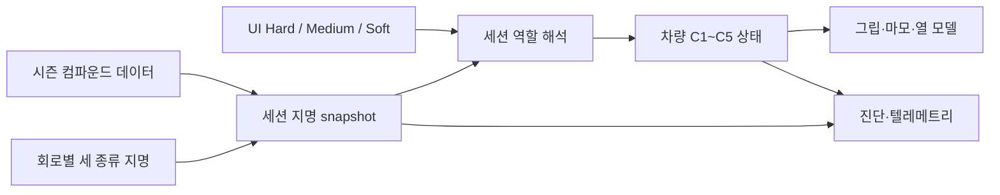

# C1~C5 타이어 컴파운드 2단계 작업 지시서

- 문서 상태: **구현 전 기준 설계**
- 작성일: **2026-07-30**
- 대상: 다음 구현 에이전트
- 선행 기준:
  - [`SIMULATION_FOUNDATION.md`](SIMULATION_FOUNDATION.md)
  - [`CURRENT_PROJECT_STATUS.md`](CURRENT_PROJECT_STATUS.md)
  - [`TIRE_THERMAL_FOUNDATION_PHASE_1_5_DIRECTIVE.md`](TIRE_THERMAL_FOUNDATION_PHASE_1_5_DIRECTIVE.md)
  - [`CIRCUIT_THERMAL_ENVIRONMENT_PHASE_1_DIRECTIVE.md`](CIRCUIT_THERMAL_ENVIRONMENT_PHASE_1_DIRECTIVE.md)

---

## 1. 목적

현재 코드는 `SOFT/MEDIUM/HARD`를 실제 물리 컴파운드인 동시에 한 경기 주말의
표시 역할로 사용한다. 이 구조에서는 Bahrain의 Soft가 C3인지, 다른 회로의 Soft가
C5인지 표현할 수 없고 모든 회로의 Soft가 같은 마모·열창·그립을 공유한다.

이번 단계의 목표는 다음과 같다.

1. 시즌의 물리 컴파운드를 `C1/C2/C3/C4/C5`로 표현한다.
2. 한 경기 주말의 `HARD/MEDIUM/SOFT` 역할을 물리 컴파운드와 분리한다.
3. 회로별로 세 개의 건식 컴파운드를 지명하고 세션 시작 시 불변 snapshot으로
   확정한다.
4. 컴파운드별 그립·마모·cliff·최적 온도·작동창을 데이터로 관리한다.
5. 예선, 출발 타이어, 피트 선택, AI 전략, 텔레메트리와 UI가 같은 지명을 사용한다.
6. 기존 Bahrain 열 모델 개선과 결정성을 깨뜨리지 않은 상태에서 C1~C5 보정을
   시작할 수 있는 테스트 기반을 만든다.

동적 날씨, 젖은 노면, 타이어 압력, 개별 휠 열 모델, 실제 재고 세트 수는 이번
단계의 범위가 아니다.

---

## 2. 공식 공개 사실과 게임 보정값의 경계

공식 공개 자료로 확인되는 범위:

- Pirelli의 2026 건식 범위는 C1부터 C5까지이며 C1이 가장 단단하고 C5가 가장
  부드럽다.
- 한 경기에는 다섯 종류 전체가 아니라 세 종류가 지명되며, 그 주말 안에서
  White Hard, Yellow Medium, Red Soft 역할을 가진다.
- 단단한 쪽은 일반적으로 내구성이 높고 고하중·고온·마모성 노면에 적합하며,
  부드러운 쪽은 더 빨리 예열되고 단일 랩 성능이 높지만 수명이 짧다.
- 2025 Bahrain은 C1=Hard, C2=Medium, C3=Soft를 사용했다. 2026 Bahrain
  프리시즌 테스트도 C1/C2/C3가 회로 특성에 맞는 단단한 세 종류로 사용됐다.

출처:

- [Pirelli 2026 Formula 1 compound range](https://www.pirelli.com/tires/en-us/motorsport/car/formula-1)
- [Pirelli: 2026 compound range confirmed](https://press.pirelli.com/the-range-of-compounds-for-the-2026-season-has-been-set/)
- [Pirelli: how three compounds are chosen](https://www.pirelli.com/global/en-ww/race/racingspot/formula-1/formula-1-for-dummies-the-choice-of-tyres-in-formula-1-53864/)
- [Formula 1: 2025 Bahrain C1/C2/C3 nomination](https://www.formula1.com/en/latest/article/what-tyres-will-the-teams-and-drivers-have-for-the-2025-bahrain-grand-prix.7gnHbNpm0OJQIjPqsWoyof)

공식 자료에서 컴파운드별 정확한 표면 최적 온도, 코어 최적 온도, 열용량,
냉각계수와 degradation 수식은 확인되지 않는다. 따라서 이 문서의 수치는
`공식 실측값`이 아니라 다음 세 종류로 구분한다.

| 분류 | 의미 |
|---|---|
| `official_public` | 공식 자료에 직접 명시된 순서·지명·규정 |
| `derived_mapping` | 공식 지명을 현재 게임 구조에 대응한 값 |
| `game_calibration_provisional` | 현재 모델 연속성과 게임 밸런스를 위한 초기값 |
| `numeric_guard` | 물리 한계가 아닌 계산 안정성 보호값 |

코드, 데이터, 주석과 보고서에서 provisional 값을 실제 Pirelli 비밀 물성이나
공식 파손 한계라고 표현하지 않는다.

---

## 3. 반드시 지켜야 할 도메인 원칙

### 3.1 물리 컴파운드와 주말 역할

다음 두 개념은 별도 타입이어야 한다.

```text
Physical compound: C1, C2, C3, C4, C5, INTER, WET
Weekend role:      HARD, MEDIUM, SOFT
```

예:

```text
Bahrain nomination
HARD   -> C1
MEDIUM -> C2
SOFT   -> C3

다른 회로의 예
HARD   -> C3
MEDIUM -> C4
SOFT   -> C5
```

`SOFT`라는 문자열만으로 물리 특성을 조회해서는 안 된다. 차량 물리와 열 모델은
항상 C 코드로 확정된 물리 컴파운드를 사용한다. UI 색상과 주말 전략 선택만 역할을
사용한다.

### 3.2 단일 권위 경로



- 회로 데이터나 UI가 물리 계수를 직접 선택하지 않는다.
- 세션 생성 뒤에는 지명과 컴파운드 사양이 바뀌지 않는다.
- 피트 요청, 예선과 출발 타이어도 동일한 세션 resolver를 사용한다.
- WebSocket 재접속이나 renderer 재생성으로 지명이 다시 계산되지 않는다.

### 3.3 수치 guard와 작동창

- 기존 `160°C surface / 140°C core`는 계산 안정성용 전역 guard로 유지한다.
- 컴파운드 작동창과 과열 진단은 guard와 별도다.
- `optimal ± operating_window`는 정상 성능 구간이다.
- 과열 진단 기준은 컴파운드별 `hot_diagnostic_threshold_c`로 명시한다.
- 기존 130°C 진단은 변경 전후 비교를 위한 `legacy_130` 지표로 한 단계 동안
  보존하고, 새 컴파운드 과열 지표와 이름을 섞지 않는다.
- threshold를 올려 clamp나 열 폭주를 숨기지 않는다.

---

## 4. 목표 데이터 모델

### 4.1 타입

권장 형태:

```python
class PhysicalTireCompound(str, Enum):
    C1 = "C1"
    C2 = "C2"
    C3 = "C3"
    C4 = "C4"
    C5 = "C5"
    INTER = "INTER"
    WET = "WET"


class DryTireRole(str, Enum):
    HARD = "HARD"
    MEDIUM = "MEDIUM"
    SOFT = "SOFT"
```

기존 `TireCompound`를 바로 재사용하거나 이름을 바꿀 수 있지만 최종 상태에서
`SOFT`와 `C3`가 같은 enum 안에 함께 존재해서는 안 된다. 대규모 rename이
필요하면 먼저 새 타입과 adapter를 추가하고 단계별로 호출부를 옮긴다.

### 4.2 물리 사양

`CompoundSpec`은 최소 다음 필드를 가진다.

```python
@dataclass(frozen=True)
class CompoundSpec:
    code: PhysicalTireCompound
    grip: float
    degradation_rate: float
    cliff_threshold_laps: float
    lateral_grip: float
    traction_grip: float
    braking_grip: float
    optimal_surface_temperature_c: float
    surface_operating_window_c: float
    hot_diagnostic_threshold_c: float
    blanket_temperature_c: float
    source_class: str
```

열용량과 냉각을 컴파운드별로 다르게 할 준비가 필요하면 아래 필드를 추가할 수
있지만, 1차 migration에서는 모두 현재 모델값 `1.0`으로 시작한다.

```text
heat_input_scale
surface_heat_capacity_scale
core_heat_capacity_scale
surface_cooling_scale
surface_core_conductance_scale
core_cooling_scale
```

여섯 계수를 처음부터 서로 다르게 추측해 넣지 않는다. 먼저 작동창·그립·마모
차이를 검증한 뒤 열수지 증거가 있는 계수군만 한 번에 하나씩 보정한다.

### 4.3 초기 migration 사양

현재 Bahrain의 Hard/Medium/Soft 동작을 가능한 한 보존하기 위해 다음 대응으로
시작한다.

| C 코드 | migration 원본 | grip | degradation | cliff laps | lateral | traction | braking | optimal °C | window ±°C | 초기 hot 진단 °C |
|---|---|---:|---:|---:|---:|---:|---:|---:|---:|---:|
| C1 | 기존 HARD | 0.970 | 0.010 | 44 | 0.985 | 0.985 | 0.990 | 105 | 16 | 136 |
| C2 | 기존 MEDIUM | 0.990 | 0.014 | 31 | 1.000 | 1.000 | 1.000 | 100 | 14 | 129 |
| C3 | 기존 SOFT | 1.005 | 0.022 | 16 | 1.025 | 1.025 | 1.015 | 95 | 12 | 122 |
| C4 | 신규 provisional | 1.012 | 0.028 | 13 | 1.035 | 1.035 | 1.022 | 92 | 11 | 118 |
| C5 | 신규 provisional | 1.020 | 0.035 | 10 | 1.045 | 1.045 | 1.030 | 90 | 10 | 115 |

위 표는 `game_calibration_provisional`이다. 특히 C4/C5는 구현을 시작하기 위한
seed이며 최종 승인값이 아니다. 다음 불변식을 먼저 만족해야 한다.

```text
fresh single-lap pace: C5 > C4 > C3 > C2 > C1
equal-input durability: C1 > C2 > C3 > C4 > C5
warm-up difficulty:     C1 >= C2 >= C3 >= C4 >= C5
numeric guard:          모든 컴파운드에서 hit 0
```

`hot_diagnostic_threshold_c`는 공식 손상 온도가 아니다. 초기값은 각 작동창 상단에
15°C 안팎의 관찰 여유를 둔 게임 진단값이다. 테스트 결과가 불합리하면 먼저
온도 분포와 그립 곡선을 검토하며 threshold만 올려 통과시키지 않는다.

### 4.4 회로별 지명

열환경 파일과 별도의 데이터 파일을 사용한다.

```text
backend/data/tire_compound_nominations.json
```

권장 schema:

```json
{
  "schema_version": 1,
  "ruleset": "2026_C1_C5",
  "circuits": [
    {
      "circuit_id": 3,
      "hard": "C1",
      "medium": "C2",
      "soft": "C3",
      "source_class": "derived_mapping",
      "source_url": "https://www.formula1.com/...",
      "status": "provisional",
      "note": "2025 Bahrain official nomination and 2026 Bahrain test context"
    }
  ]
}
```

Bahrain은 우선 `C1/C2/C3`를 사용한다. 나머지 회로는 공식 시즌 지명을 조사해
입력하되 확인하지 못한 값은 반드시 `provisional`로 표시한다. 모든 회로에
`C1/C2/C3`를 복사해서 완료 처리하지 않는다.

검증 규칙:

- 정확히 세 개의 서로 다른 건식 C 코드
- `hard < medium < soft` 순서
- C1~C5 밖의 값 금지
- circuit ID 누락·중복·미등록 즉시 실패
- ruleset과 source metadata 필수
- 세션 시작 후 deep copy 또는 frozen model로 불변

---

## 5. 단계별 작업

### 5.1 1단계 — 도메인 타입과 데이터 계약

#### 구현

1. 물리 C 코드 enum과 주말 역할 enum을 분리한다.
2. C1~C5 사양을 단일 권위 데이터 또는 immutable table로 추가한다.
3. 회로별 지명 loader와 검증기를 추가한다.
4. `Circuit` 또는 별도 session setup 모델에 지명 정보를 연결한다.
5. 기존 SOFT/MEDIUM/HARD 사양은 migration table을 통해 C3/C2/C1에 각각
   일대일 대응시키고 중복 상수를 만들지 않는다.

#### 주요 파일

- `backend/models/schemas.py`
- `backend/data_loader.py`
- `backend/data/tire_compound_nominations.json`
- `backend/simulation/tire_model.py`
- 신규 `backend/tests/test_tire_compound_nominations.py`

#### 필수 테스트

- enum 직렬화·역직렬화
- 모든 C 코드의 사양 존재
- 사양 수치 finite 및 유효 범위
- C1→C5 그립·마모·cliff 순서
- 회로 지명 세 종류·순서·중복 검증
- 누락·미등록 circuit fail-fast
- Bahrain `HARD/MEDIUM/SOFT -> C1/C2/C3`
- 기존 HARD/MEDIUM/SOFT와 C1/C2/C3 migration 수치 일치

#### 완료 조건

- 이 단계에서는 런타임 차량 타입을 아직 바꾸지 않아도 된다.
- 새 데이터와 resolver가 기존 테스트에 영향을 주지 않는 상태로 먼저 병합한다.

---

### 5.2 2단계 — 세션 해석과 API 계약

#### 구현

1. `RaceSession` 생성 시 회로 지명을 한 번 해석해 session-owned snapshot으로
   저장한다.
2. 기존 `starting_tires` 입력은 UI 역할을 받도록 명시하고 세션 경계에서 C 코드로
   변환한다.
3. 엔진의 `DriverRaceState`는 권위 `physical_tire_compound`를 저장한다.
4. 출력에는 migration 기간 동안 두 필드를 모두 제공한다.

```json
{
  "tire_compound": "C2",
  "tire_role": "MEDIUM"
}
```

5. `race_info`, setup 응답과 진단에 ruleset 및 지명 snapshot을 노출한다.
6. 잘못된 역할, 지명에 없는 C 코드, 역할과 C 코드가 서로 맞지 않는 요청은
   4xx로 거부한다.
7. 기존 클라이언트 호환 adapter를 둔다면 한 군데에서만 처리하고 제거 예정
   주석과 테스트를 둔다.

#### 주요 파일

- `backend/models/schemas.py`
- `backend/main.py`
- `backend/session.py`
- `backend/simulation/race_engine.py`
- `backend/simulation/start_ops.py`
- `backend/simulation/pit_stop.py`
- `backend/tests/test_api.py`
- `backend/tests/test_session.py`

#### 필수 테스트

- setup 요청의 role→C 해석
- session snapshot 불변성
- race_info/dashboard/history의 C 코드와 역할 일치
- WebSocket 재접속 후 동일 지명
- 잘못된 요청 4xx
- 동일 seed에서 legacy Bahrain 입력과 새 C1/C2/C3 입력의 초기 상태 일치

#### 완료 조건

- 엔진 내부 물리는 더 이상 SOFT/MEDIUM/HARD 문자열로 사양을 조회하지 않는다.

---

### 5.3 3단계 — 물리·열·마모·진단

#### 구현

1. `compute_wear`, `compute_tire_performance`,
   `compute_tire_physics_factors`, `tire_temperature_grip_factor`,
   `tire_blanket_temperature_c`가 물리 C 코드를 받는다.
2. 작동창 하단·상단과 hot 진단 기준을 사양에서 계산한다.
3. 열 모델의 전역 guard는 유지하고 작동창과 분리한다.
4. 진단 schema를 다음처럼 확장한다.

```text
compound_distribution
current.compound_overheat_driver_count
current.compound_overheat_driver_ids
peak.max_compound_overheat_driver_count
peak.max_continuous_compound_overheat_seconds
per_compound.C1 ... C5:
  active_count
  surface_min/max
  core_min/max
  operating_lower/upper
  hot_threshold
  current_overheat_count
  peak_overheat_count
```

5. 배열을 무한 축적하지 않고 C 코드 다섯 개의 bounded aggregate만 유지한다.
6. 기존 130°C 회귀는 명시적으로 `legacy_130` 이름을 붙여 한 단계 동안 병행한다.
7. 피트 교체 시 새 컴파운드의 blanket 온도로 네 개 호환/축별 온도를 모두
   초기화하고 이전 컴파운드 연속 과열 타이머를 종료한다.
8. 캐시 키에 물리 C 코드와 열 관련 사양 fingerprint를 포함한다.

#### 열 계수 보정 규칙

- 먼저 모든 C 코드에 현재 열용량·냉각 scale `1.0`을 사용한다.
- C 코드별 온도 자체를 다르게 만들 목적으로 임의 상수를 한꺼번에 바꾸지 않는다.
- 같은 물리 입력에서 작동창 차이만으로 성능 차이가 충분한지 먼저 검증한다.
- 부족하면 cumulative source heat와 cooling을 비교해 한 번에 한 계수군만 변경한다.
- `160/140°C` guard, 환경 프리셋이나 진단 threshold를 먼저 변경하지 않는다.

#### 필수 테스트

- 각 C 코드의 cold/optimal/hot 연속 그립 곡선
- 경계 바로 전후의 불연속 없음
- C1~C5 같은 입력의 에너지 보존
- 0.02/0.05/0.10초 누적 에너지 안정성
- compound별 overheat/회복/피트 교체 타이머
- guard hit/overshoot 기존 회귀
- controller cache가 C 코드·사양 변경을 구분
- 57랩 surrogate에서 finite, clamp 0, 평형 형성

#### 완료 조건

- 컴파운드 차이가 단순 UI 라벨이 아니라 그립·마모·열 성능에 실제로 반영된다.
- 열수지 합계가 기존 축별 에너지 계약을 깨지 않는다.

---

### 5.4 4단계 — 예선·전략·피트·UI

#### 예선

- `qualifying.py`의 하드코딩 `TireCompound.SOFT`를 제거한다.
- 해당 세션의 주말 Soft 역할을 물리 C 코드로 해석한다.
- 예선 응답에 사용 C 코드와 역할을 포함한다.
- 열환경 프리셋 변경으로 예선 요청이 무효화되는 기존 async 계약을 유지한다.

#### AI 전략

- `choose_tire_for_remaining_laps()`의 고정 12/28랩 분기만으로 C 코드를 선택하지
  않는다.
- 세션에 지명된 세 종류만 후보로 사용한다.
- 최소한 남은 랩, 현재 compound, 예상 wear/cliff, pit loss, 환경과 현재
  surface/core 온도를 평가한다.
- 같은 compound로의 무의미한 교체를 피하고 건조 레이스의 두 종류 사용 규칙은
  별도 ruleset flag로 구현한다. 이번 단계에서 강제 적용하지 않으면 미구현으로
  명시한다.
- 결정성 테스트를 위해 동일 seed와 snapshot에서 같은 선택을 보장한다.

#### UI

- Race Setup과 Strategy Panel은 주말에 지명된 세 종류만 표시한다.
- 표시는 `HARD · C1`, `MEDIUM · C2`, `SOFT · C3`처럼 역할과 C 코드를 함께 보여준다.
- 배지 색상은 역할 기준 White/Yellow/Red를 유지한다.
- 데이터 센터와 타이밍 보드는 C 코드와 역할을 혼동하지 않는다.
- 회로를 변경하면 지명, 출발 타이어 선택, 기존 예선 결과를 함께 무효화한다.
- 프리셋 변경 때 로딩을 즉시 해제하고 stale 응답을 거부하는 현재 회귀를 유지한다.

#### 주요 파일

- `backend/simulation/qualifying.py`
- `backend/simulation/ai_strategy.py`
- `backend/simulation/pit_ops.py`
- `frontend/src/components/RaceSetup.jsx`
- `frontend/src/components/raceSetupContract.js`
- `frontend/src/components/Dashboard/StrategyPanel.jsx`
- `frontend/src/components/Dashboard/TimingBoard.jsx`
- `frontend/src/components/Dashboard/DriverDataCenter.jsx`

#### 필수 테스트

- Bahrain UI에 H·C1 / M·C2 / S·C3만 표시
- 회로 변경 시 지명과 출발 선택 reset
- qualifying/setup/pit payload가 같은 resolver 결과 사용
- stale qualifying 응답이 새 회로·지명을 덮어쓰지 않음
- AI가 지명 밖 C4/C5를 Bahrain에서 선택하지 않음
- 짧은 stint에서 상대적으로 부드러운 쪽, 긴 stint에서 단단한 쪽이 유리
- 피트 전후 telemetry/history의 compound 전환 시점 정확성
- 프런트엔드 test/lint/build

#### 완료 조건

- 사용자, AI, 예선과 물리가 모두 같은 세 종류를 사용한다.

---

### 5.5 5단계 — 보정 매트릭스와 제품 승인

#### 5.5.1 변경 전 기준 보존

C1~C5 코드를 런타임에 적용하기 전에 기존 패키지로 Bahrain
`NORMAL 30/40°C`, 57랩·20대 수동 표본을 한 번 남긴다.

필수 기록:

- seed와 앱/package 식별자
- 완주 20대
- 각 기존 역할별 사용 시간·랩·최고 surface/core
- 후륜 표면/코어 전체 최고
- 130°C 초과 차량·연속 시간
- clamp
- 결과 화면과 New Race 60초 cleanup

이 표본이 없더라도 구현 브랜치를 시작할 수는 있지만 C1~C5 전후 제품 동등성
승인을 닫을 수는 없다.

#### 5.5.2 자동 테스트 매트릭스

| 축 | 값 |
|---|---|
| 물리 컴파운드 | C1, C2, C3, C4, C5 |
| 환경 | COOL, NORMAL, HOT |
| 입력 | conserve, standard, push |
| 시간 | warm-up, 10랩 상당, 57랩 상당 |
| 스텝 | 0.02, 0.05, 0.10초 |

전체 조합을 실제 20대 실시간으로 실행하지 않는다. 단위/결정론 surrogate로
전체 행렬을 검사하고, 실제 엔진 장기는 대표 조합만 선택한다.

필수 관계:

```text
동일 compound/input: COOL <= NORMAL <= HOT 평형 온도
동일 환경/input:     push >= standard >= conserve 발열
동일 환경/age 0:     C5가 C1보다 빠름
긴 stint 총시간:     항상 C5가 최선이면 실패
모든 조합:           finite, surface/core clamp 0
입력 완화:           과열에서 회복 가능
```

#### 5.5.3 Bahrain migration 동등성

Bahrain C1/C2/C3는 기존 Hard/Medium/Soft의 migration 기준이다.

- 같은 seed·환경·입력·시간에서 랩타임 결과: 기존 대비 합리적 허용 범위를 먼저
  보고하고 고정한다.
- 누적 열원별 에너지: 기존 대비 ±1%
- 후륜 표면/코어 최고: 기존 대비 ±1°C
- clamp와 20대 동시 과열: 증가하지 않음
- 피트 타이어 선택과 history 순서: 기존 역할과 동일

C4/C5 추가 때문에 Bahrain C1/C2/C3가 자동으로 달라져서는 안 된다.

#### 5.5.4 실제 제품 승인

최소 수동 실행:

1. Bahrain Normal 30/40°C, C1/C2/C3, 57랩·20대
2. Bahrain Hot 36/52°C, C1/C2/C3, 짧은 비교 또는 필요 시 57랩
3. C4/C5가 지명되는 대표 저하중 회로 1개, Normal, 단축 레이스
4. 각 실행 뒤 New Race 60초 cleanup

Bahrain Normal 기준:

- 결과 차량 20대
- surface/core guard hit 0
- 모든 차량이 같은 최고값으로 포화되지 않음
- 컴파운드별 hot threshold 초과가 bounded이며 입력 완화·피트로 회복
- 기존 legacy 130 진단도 함께 보고
- 결과 순위, 랩 기록과 피트 compound history 일치
- active session/client/loop/WebSocket/canvas/geometry/texture/pose 정리

Hot 기준:

- Normal보다 높은 온도는 허용
- clamp 0
- C 코드별 분포가 진단에 남음
- conserve와 standard 사이 회복 차이가 있음
- 종료 또는 입력 완화 뒤 과열 차량 수가 감소

#### 5.5.5 전체 회귀

```bash
cd backend
.venv/bin/python -m unittest discover -s tests

cd ../frontend
npm test
npm run lint
npm run build

cd ../desktop
npm test

cd ..
git diff --check
```

장기 테스트는 일반 전체 discovery에 무조건 중복 포함하지 말고 `slow` 또는 명시적
실행 경로를 제공한다. 다만 최종 보고에는 빠른 전체 회귀와 장기 회귀 결과를
각각 기록한다.

---

## 6. 구현 금지 사항

- SOFT를 언제나 C5, HARD를 언제나 C1로 전역 고정하지 않는다.
- 회로 지명 없이 모든 C1~C5를 실제 경기 선택지로 노출하지 않는다.
- C1~C5를 추가하면서 기존 열 guard나 환경값을 동시에 바꾸지 않는다.
- C4/C5를 맞추기 위해 C1/C2/C3 migration 기준을 무근거로 재보정하지 않는다.
- 작동창 밖이면 온도를 강제로 최적값으로 되돌리지 않는다.
- 피트스톱 외에 compound·wear·core 온도를 초기화하지 않는다.
- AI가 UI에 없는 compound를 선택하지 않는다.
- qualifying, setup과 pit에 서로 다른 role resolver를 만들지 않는다.
- diagnostics에 차량별 무한 시계열을 저장하지 않는다.
- 공식 출처가 없는 온도·열용량을 실제 Pirelli 실측값이라고 기록하지 않는다.
- INTER/WET을 삭제하지 않는다. 건조 모델에서 기존 비활성 상태로 보존한다.

---

## 7. 단계별 보고 형식

각 단계 완료 때 다음 형식으로 보고한다.

```text
단계:
변경 파일:
권위 데이터/타입 변경:
호환 adapter:
추가 테스트:
실행 결과:
결정성 영향:
열수지 영향:
기존 대비 수치:
남은 provisional 값:
다음 단계 진입 가능 여부:
```

계수 보정이 있으면 반드시 다음을 추가한다.

```text
실패한 시나리오:
변경 전 source별 heat/cooling:
변경한 단일 계수군:
변경 이유:
변경 후 source별 heat/cooling:
다른 환경·compound 회귀:
```

---

## 8. 최종 완료 정의

다음 항목을 모두 만족해야 C1~C5 2단계를 완료로 기록한다.

- [ ] C1~C5 물리 타입과 Hard/Medium/Soft 역할이 분리됐다.
- [ ] 모든 차량 물리·열·마모 계산이 C 코드를 사용한다.
- [ ] 회로별 세 종류 지명이 데이터로 검증된다.
- [ ] Bahrain은 C1/C2/C3로 해석된다.
- [ ] qualifying/setup/pit/AI/UI가 동일한 세션 resolver를 사용한다.
- [ ] UI가 역할과 C 코드를 함께 표시한다.
- [ ] 컴파운드별 작동창·hot 진단과 legacy 130 진단이 구분된다.
- [ ] C1~C5 × Cool/Normal/Hot 자동 매트릭스가 통과한다.
- [ ] 누적 열수지와 스텝 안정성이 유지된다.
- [ ] 모든 대표 장기 실행에서 numeric clamp가 0이다.
- [ ] Bahrain Normal 57랩·20대 migration 승인이 완료됐다.
- [ ] C4/C5 대표 회로 단축 제품 검증이 완료됐다.
- [ ] New Race 60초 cleanup이 유지된다.
- [ ] Backend/frontend/desktop 전체 회귀와 diff check가 통과한다.
- [ ] `CURRENT_PROJECT_STATUS.md`에 최종 사양, provisional 값과 검증 결과가 반영됐다.

---

## 9. 구현 에이전트용 실행 프롬프트

```text
/Users/kimyongjin/Desktop/f1 프로젝트에서
docs/TIRE_COMPOUND_C1_C5_PHASE_2_DIRECTIVE.md를 기준으로 C1~C5 타이어 컴파운드
2단계를 구현하라.

작업 전 다음 문서를 순서대로 읽어라.
1. docs/SIMULATION_FOUNDATION.md
2. docs/CURRENT_PROJECT_STATUS.md
3. docs/TIRE_THERMAL_FOUNDATION_PHASE_1_5_DIRECTIVE.md
4. docs/CIRCUIT_THERMAL_ENVIRONMENT_PHASE_1_DIRECTIVE.md
5. docs/TIRE_COMPOUND_C1_C5_PHASE_2_DIRECTIVE.md

반드시 1~5단계를 순서대로 수행하라.

핵심 계약:
- 물리 C1~C5와 주말 HARD/MEDIUM/SOFT 역할을 별도 타입으로 만든다.
- Bahrain 역할은 HARD=C1, MEDIUM=C2, SOFT=C3로 해석한다.
- 차량 물리·마모·열 모델은 역할 문자열이 아니라 물리 C 코드를 사용한다.
- 회로 지명은 검증된 데이터에서 읽고 세션 시작 시 불변 snapshot으로 고정한다.
- 기존 C1/C2/C3 migration 수치와 열수지를 먼저 보존한 뒤 C4/C5를 추가한다.
- 160/140°C numeric guard, 회로 열환경과 기존 열원 계수를 동시에 바꾸지 않는다.
- 정확한 공개 근거가 없는 온도와 열 계수는 game_calibration_provisional로 남긴다.
- qualifying, setup, pit, AI와 UI는 하나의 role resolver를 공유한다.
- 진단은 compound별 bounded aggregate를 사용하고 무한 시계열을 저장하지 않는다.
- 기존 사용자 변경을 덮어쓰거나 무관한 코드를 정리하지 않는다.

각 단계마다 지시서의 테스트를 먼저 추가하거나 갱신하고 관련 테스트를 통과시켜라.
실패를 threshold 상향이나 강제 냉각으로 숨기지 말고 source별 누적 열수지로 원인을
확인하라. 보정은 한 번에 한 계수군만 변경하라.

마지막에 Backend 전체 unittest, frontend test/lint/build, desktop test,
git diff --check를 실행하라. 장기 테스트는 별도 결과로 보고하라.
docs/CURRENT_PROJECT_STATUS.md에는 실제 구현 결과와 아직 provisional인 값을
구분해 반영하라.

최종 보고에는 다음을 포함하라.
- 단계별 완료/미완료
- 변경 파일
- 최종 C1~C5 사양과 출처 분류
- 회로별 지명과 Bahrain mapping
- API migration/호환 계약
- 컴파운드별 열·마모·랩타임 검증값
- 자동/장기/수동 테스트 결과
- numeric clamp와 legacy 130/compound overheat 결과
- 남은 위험과 다음 작업
```
