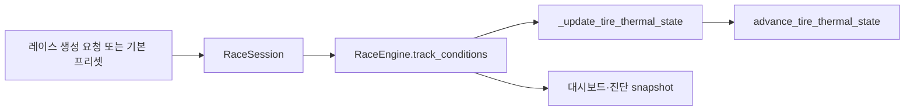

# 타이어 열 모델 기반 수정 1~5단계 작업 지시서

## 0. 문서 상태

- 문서 목적: 다른 구현 에이전트가 현재 바레인 후륜 장기 과열을 숨기지 않고 원인 단위로 수정할 수 있도록 1~5단계의 구현 순서, 경계, 테스트와 승인 기준을 고정한다.
- 적용 범위: 전·후축 슬라이드 에너지 분리, 열원별 진단, 세션 환경 전달, 열 상한 도달 진단, 장기 열 평형 회귀 테스트.
- 후속 범위: C1~C5 물리 컴파운드와 주말 `SOFT/MEDIUM/HARD` 역할 분리, 동적 날씨, 시간대별 노면 온도 변화는 이 문서 완료 후 별도 작업으로 진행한다.
- 현재 기준 재현: 바레인 57랩·20대에서 후륜 표면 최고 `155.554°C`, 후륜 코어 최고 `140°C`, 한 차량의 연속 130°C 초과 약 `2,411.24초`, 최대 동시 과열 20대가 기록됐다.
- 별도 요청이 없으면 커밋과 푸시는 하지 않는다.

## 1. 작업 목표

이번 작업은 단순히 후륜 온도를 낮추는 상수 조정이 아니다. 다음 다섯 가지를 순서대로 완성한다.

1. 권위 있는 물리 단계에서 전·후축 슬라이드 에너지를 별도로 계산한다.
2. 타이어 표면·코어 온도 변화의 열원과 냉각원을 축별로 계측한다.
3. 타이어 열 모델에 세션의 대기·노면 온도를 명시적으로 전달한다.
4. 표면·코어 하드 클램프 도달을 숨기지 않고 진단으로 노출한다.
5. 짧은 단위 테스트를 넘어 장기 열 평형·회복·환경 민감도 회귀 테스트를 추가한다.

완료 후에는 다음 질문에 로그와 테스트로 답할 수 있어야 한다.

- 어느 축에서 어떤 종류의 에너지가 가장 많이 발생했는가
- 표면 발열과 주행풍 냉각 중 어느 쪽이 우세한가
- 코어가 140°C에 붙기 전에 계산상 온도가 얼마까지 올라가려 했는가
- 대기·노면 온도를 바꿨을 때 같은 입력의 평형 온도가 어떻게 달라지는가
- 공격 주행 뒤 보존 주행 또는 SC 속도에서 실제로 온도가 회복되는가
- 정상 바레인 전 경기에서 하드 클램프가 한 번이라도 작동했는가

## 2. 현재 확인된 문제와 코드 위치

### 2.1 합산 슬라이드 에너지

`backend/simulation/vehicle_physics.py`의 `VehiclePhysicsStepResult`는 현재 `tire_slide_energy_j` 하나만 제공한다. 가속 중 구동력 초과분과 제동 중 제동력 초과분도 같은 값에 누적된다.

`backend/simulation/strategy_ops.py::_update_tire_thermal_state()`는 이 합산값을 전·후축 최대 슬립률 비율로 다시 나눈다. 한 틱에서 기록된 최대 슬립률은 그 틱 전체 에너지의 실제 발생 위치를 보장하지 않으므로, 전륜 락업 에너지와 후륜 트랙션 손실 에너지가 잘못 배분될 수 있다.

### 2.2 고정된 후륜 트랙션 발열

현재 전·후륜 호출은 `traction_heat_share=0.08/0.92`를 사용한다. 이는 실제 전달 구동력이나 이동 거리로 계산한 에너지가 아니라 `throttle × 상수` 발열을 고정 비율로 나눈 것이다.

### 2.3 고정 환경 기본값

`backend/simulation/tire_model.py::advance_tire_thermal_state()`는 대기 `30°C`, 노면 `40°C`를 기본 인자로 사용한다. 호출자는 세션 환경을 전달하지 않으므로 모든 서킷과 시간대가 같은 열 경계조건을 사용한다.

### 2.4 상한이 폭주를 가림

표면은 `160°C`, 코어는 `140°C`로 잘린다. 반환값만 보면 실제 계산상 온도가 상한을 얼마나 초과하려 했는지, 몇 번 잘렸는지 알 수 없다.

### 2.5 장기 평형 테스트 부재

현재 타이어 테스트는 고온·저온 grip 차이와 슬라이드 에너지가 표면을 더 가열하는지만 확인한다. 브레이크 모델에는 반복 랩 장기 평형 테스트가 있지만 타이어에는 대응 테스트가 없다.

## 3. 공통 작업 원칙

- 현재 작업 트리는 dirty 상태다. 기존 변경은 사용자 소유로 취급하고 관련 없는 파일을 되돌리거나 정리하지 않는다.
- 물리 50Hz, AI 10Hz, pose 30Hz, 렌더 최대 60FPS와 1x/2x 결정론 구조를 유지한다.
- 온도 임의 감소, 매 랩 강제 냉각, 피트 외 타이어 상태 초기화, 130°C 진단 기준 상향으로 현상을 숨기지 않는다.
- `160/140°C` 상한을 높이거나 낮추는 것으로 승인받지 않는다. 상한은 수치 안전장치로 유지하고 정상 주행에서는 도달하지 않도록 한다.
- 에너지는 가능한 한 줄 단위의 힘·속도·거리에서 발생 축을 결정한다. 이미 합산된 값을 사후 추정으로 나누지 않는다.
- 모든 열량은 단위를 이름에 포함한다. 순간 출력은 `_w`, 물리 스텝 누적 에너지는 `_j`, 온도는 `_c`, 시간은 `_seconds`를 사용한다.
- 진단을 위해 물리 이력을 무제한 저장하지 않는다. 현재값, 누적값, 최고값, 최초 발생과 bounded sample만 유지한다.
- 기존 API 필드는 바로 삭제하지 않는다. 합산 필드는 호환용 파생값으로 유지하되 권위값은 전·후축 필드가 되게 한다.
- C1~C5 도입을 이번 변경에 섞지 않는다. 현재 `SOFT/MEDIUM/HARD` 계약을 유지한 상태에서 열 모델 기반부터 안정화한다.
- 테스트가 실패하면 기준을 낮추기 전에 열수지 로그로 원인을 설명한다.

## 4. 단계별 실행 순서와 게이트

각 단계는 독립된 검토 단위다. 앞 단계의 테스트와 승인 조건을 통과하기 전에는 다음 단계의 보정 작업을 시작하지 않는다.


---

## 5. 1단계 — 전·후축 슬라이드 에너지 분리

### 5.1 목표

각 물리 스텝에서 발생한 슬라이드 에너지를 발생 축에서 직접 누적한다. 후속 열 모델은 전·후축 합산값을 재분배하지 않고 해당 축의 값을 그대로 소비한다.

### 5.2 목표 데이터 계약

`VehiclePhysicsStepResult`와 필요한 권위 상태에 다음 필드를 추가한다.

```python
front_tire_slide_energy_j: float
rear_tire_slide_energy_j: float
tire_slide_energy_j: float  # 호환용 합계
```

항상 다음 불변식을 만족해야 한다.

```python
tire_slide_energy_j == (
    front_tire_slide_energy_j + rear_tire_slide_energy_j
)
```

부동소수점 비교에는 명시적인 작은 허용오차를 사용한다.

### 5.3 에너지 발생 위치

#### 후륜 구동 슬립

현재 차량이 후륜구동이라는 프로젝트 기준에 따라 가속 중 구동 요청이 후륜 가용 트랙션을 초과해 발생한 슬라이드 에너지는 후륜에 누적한다.

```python
rear_drive_slide_energy_j += (
    max(0.0, requested_drive_force_n - applied_drive_force_n)
    * speed_mps
    * step_seconds
)
```

단위는 반드시 `N × m/s × s = J`가 되어야 한다.

#### 제동 락업

제동 중 에너지는 실제 전·후축 제동력 요청과 각 축의 가용 종방향 힘을 기준으로 나눈다.

- 현재 물리 모델이 축별 제동 요청을 이미 내부적으로 계산한다면 그 값을 사용한다.
- 아직 축별 제동력이 없다면 `front_brake_bias`와 축별 정상하중·가용 마찰력을 사용해 전·후축 요청·적용 힘을 같은 스텝에서 계산한다.
- 합산 락업 에너지를 스텝 종료 후 최대 슬립률 비율로 나누는 방식은 사용하지 않는다.
- 완전한 네 바퀴 독립 락업 모델로 확장하지 않는다. 이번 범위는 전·후축 평균이다.

### 5.4 트랙션 열원 정리

1단계에서는 실제 후륜 구동 작업량을 열 모델이 소비할 수 있도록 다음 값 중 하나를 권위 결과로 제공한다.

권장:

```python
rear_applied_drive_energy_j
```

대안:

```python
applied_drive_force_n
distance_travelled_m
```

후속 2단계에서 이를 후륜 트랙션 발열로 변환한다. 기존 `throttle × 1800W × 0.92`는 바로 제거하거나 호환 전환 기간에만 유지하되, 실제 에너지와 동시에 적용해 이중 발열을 만들지 않는다.

### 5.5 예상 수정 파일

- `backend/simulation/vehicle_physics.py`
- `backend/simulation/strategy_ops.py`
- `backend/models/schemas.py`
- `backend/simulation/race_engine.py`
- `backend/tests/test_vehicle_physics.py`
- `backend/tests/test_fuel_and_tire_strategy.py`
- 필요 시 세션/API 직렬화 테스트

실제 구조상 더 적은 파일로 해결되면 범위를 줄여도 된다.

### 5.6 필수 테스트

1. 깨끗한 정속 주행에서는 두 축 슬라이드 에너지가 모두 0 또는 수치 허용오차 이하다.
2. 직선 후륜 휠스핀에서는 후륜 값만 증가한다.
3. 전륜 제한 제동에서는 전륜 값이 후륜보다 크게 증가한다.
4. 후륜 제한 제동 조건에서는 후륜 값도 증가한다.
5. 모든 조건에서 전축+후축=합계 불변식을 만족한다.
6. 동일한 총 시뮬레이션 시간과 입력에서 0.02초 기본 스텝과 테스트용 세분 스텝의 누적 에너지가 허용 범위 안에서 일치한다.
7. 기존 `tire_slide_energy_j` 소비자와 API가 깨지지 않는다.

### 5.7 1단계 완료 조건

- `strategy_ops.py`에서 합산 슬라이드 에너지를 `front_slip / total_slip`으로 재분배하는 코드가 제거된다.
- 후륜 구동 슬립과 제동 락업 에너지의 발생 축이 테스트로 증명된다.
- 기존 물리 테스트와 새 에너지 불변식 테스트가 모두 통과한다.

---

## 6. 2단계 — 축별 열원·냉각원 진단

### 6.1 목표

온도가 올라갔다는 결과만 기록하지 않고, 각 스텝의 열수지를 설명할 수 있게 한다.

### 6.2 권장 열수지 데이터 구조

`advance_tire_thermal_state()`의 반환값에 열수지 객체를 포함하거나 별도 반환 타입을 만든다.

```python
@dataclass(frozen=True)
class TireThermalBudget:
    baseline_heat_j: float
    lateral_heat_j: float
    braking_heat_j: float
    traction_heat_j: float
    slide_heat_j: float

    surface_air_track_cooling_j: float
    surface_to_core_transfer_j: float
    core_ambient_cooling_j: float

    surface_net_energy_j: float
    core_net_energy_j: float
```

이름은 현재 코드 스타일에 맞춰 조정할 수 있으나, 다음 항목은 합치지 않는다.

- baseline
- lateral
- braking
- traction
- sliding
- 표면 외부 냉각
- 표면→코어 전달
- 코어→외기 냉각

### 6.3 계산 원칙

- 내부 계산은 가능하면 스텝 에너지 `J`로 통일한다.
- 기존 출력 `W` 계수는 `delta_seconds`를 곱해 에너지로 변환한다.
- 표면→코어 전달은 표면에서는 손실, 코어에서는 유입으로 같은 절대량을 사용한다.
- 열수지 합계와 실제 온도 변화가 열용량을 기준으로 일치해야 한다.
- `delta_seconds == 0`에서는 온도와 누적 에너지가 변하지 않아야 한다.
- 음수 속도·스로틀·브레이크·슬라이드 입력은 기존 방어 규칙에 따라 0으로 제한한다.

### 6.4 레이스 진단 집계

기존 타이어 온도 진단을 확장해 최소한 다음을 축별로 제공한다.

```text
current:
  front/rear heat input W
  front/rear cooling W
  front/rear net W
  source별 heat W

peak:
  source별 최고 W
  최고 net heating W
  최고 cooling W

cumulative:
  source별 energy J
  cooling energy J
```

20대 전체의 모든 스텝을 배열로 보존하지 않는다. 다음 중 하나를 사용한다.

- 현재값
- 누적값
- 최고값
- bounded 최근 표본
- 드라이버별 작은 집계 객체

진단 schema version을 올리고 기존 필드는 유지한다. 데스크톱 진단 로그가 새 필드를 직렬화할 수 있는지 확인한다.

### 6.5 후륜 트랙션 발열 전환

1단계의 실제 후륜 구동 작업량을 다음과 같이 열량으로 전환한다.

```python
traction_heat_j = rear_applied_drive_energy_j * traction_to_heat_factor
```

- 변환계수는 중앙 상수 또는 모델 파라미터로 명명한다.
- `throttle` 자체를 에너지로 취급하지 않는다.
- 실제 구동 작업 기반 발열과 기존 `throttle × 1800W`를 동시에 더하지 않는다.
- 변환계수의 근거가 실측값이 아니면 `game_calibration` 값임을 주석과 문서에 표시한다.

### 6.6 필수 테스트

1. 각 열원 입력을 하나씩 켰을 때 해당 budget 항목만 예상 방향으로 증가한다.
2. 표면→코어 전달 에너지는 두 노드에서 크기가 같고 부호가 반대다.
3. 총 열입력-총 열손실과 온도 변화가 열용량 기준 허용오차 안에서 일치한다.
4. 같은 입력에서 스텝을 나눠도 누적 열량이 과도하게 달라지지 않는다.
5. 슬라이드가 없는 정속 주행에서 slide heat는 0이다.
6. 후륜 휠스핀에서 rear slide heat가 증가하고 front slide heat는 증가하지 않는다.
7. 진단 snapshot 크기가 레이스 시간에 비례해 증가하지 않는다.

### 6.7 2단계 완료 조건

- 한 시점의 후륜 발열을 baseline/lateral/braking/traction/sliding으로 설명할 수 있다.
- 후륜 코어 상승이 표면→코어 전달과 수치적으로 연결된다.
- 진단 수집을 켜고 꺼도 물리 결과가 동일하다.
- 진단 자료 구조가 bounded임을 테스트 또는 명시적 상한으로 증명한다.

---

## 7. 3단계 — 세션 대기·노면 온도 명시 전달

### 7.1 목표

타이어 모델 내부의 고정 기본값을 제거하고, 레이스 세션이 소유한 환경 상태를 매 물리 스텝에 명시적으로 전달한다.

### 7.2 환경 상태의 소유권

환경은 타이어가 아니라 세션 또는 레이스 엔진이 소유한다.

최소 1차 구조:

```python
@dataclass(frozen=True)
class TrackConditions:
    ambient_temperature_c: float
    track_temperature_c: float
```

향후 확장 필드:

```text
wind_speed_mps
track_wetness
rubber_level
solar_load
```

향후 필드는 이번 단계에서 물리에 연결하지 않아도 된다. 사용하지 않는 임의 필드를 미리 직렬화할 필요도 없다.

### 7.3 API와 기본값

- 기존 클라이언트 호환을 위해 API 또는 세션 생성 경계에서는 현재 기준 `30/40°C`를 기본 프리셋으로 제공할 수 있다.
- `advance_tire_thermal_state()` 내부 기본 인자는 제거하고 두 온도를 필수 keyword argument로 만든다.
- 환경 기본값은 한 곳에서만 정의한다. API, 엔진, 타이어 모델에 같은 숫자를 중복 선언하지 않는다.
- 입력은 유한한 숫자인지 검증한다. 허용 범위는 게임 설계 상수로 중앙화한다.
- 노면 온도가 대기 온도보다 반드시 높다는 가정은 검증 규칙으로 강제하지 않는다. 야간·우천·급격한 기상 변화 확장을 막을 수 있다.

### 7.4 데이터 흐름



열 모델이 전역 변수, 환경 변수 또는 서킷 이름으로 온도를 추론하지 않게 한다.

### 7.5 직렬화와 표시

최소한 진단 snapshot과 레이스 정보 payload에서 현재 값을 확인할 수 있어야 한다.

```json
{
  "track_conditions": {
    "ambient_temperature_c": 30.0,
    "track_temperature_c": 40.0
  }
}
```

이번 단계에서 날씨 UI 편집 화면을 반드시 추가할 필요는 없다. 테스트와 API로 값을 주입할 수 있고 현재 조건이 진단에 보이면 충분하다.

### 7.6 필수 테스트

1. 환경값을 생략한 기존 레이스 생성 요청은 중앙 기본 프리셋을 사용한다.
2. 명시한 대기·노면 값이 엔진과 타이어 모델까지 그대로 전달된다.
3. 동일 입력에서 노면 온도가 높을수록 다른 조건이 같을 때 표면 평형 온도가 낮아지지 않는다.
4. 동일 입력에서 대기 온도가 높을수록 코어 평형 온도가 낮아지지 않는다.
5. 같은 seed와 같은 환경에서는 1x/2x가 같은 물리 결과를 만든다.
6. 세션 도중 환경을 변경하는 API가 아직 없다면 상태는 immutable이어야 한다.
7. 진단과 대시보드가 실제 사용 중인 환경값을 반환한다.

### 7.7 3단계 완료 조건

- `advance_tire_thermal_state()` 호출 중 암묵적인 `30/40°C` 사용이 없다.
- 모든 호출자가 환경값을 명시적으로 전달한다.
- 바레인 Cool/Normal/Hot 테스트 프리셋을 코드 테스트에서 주입할 수 있다.
- 동적 날씨를 구현하지 않고도 향후 시간대별 환경 상태로 교체 가능한 소유권이 정리된다.

---

## 8. 4단계 — 표면·코어 하드 클램프 도달 진단

### 8.1 목표

수치 안전 상한은 유지하되, 클램프가 정상 모델 동작처럼 보이지 않도록 모든 도달을 기록한다.

### 8.2 열 스텝 반환값

클램프 적용 전 계산값과 적용 여부를 반환한다.

```python
surface_unclamped_temperature_c: float
core_unclamped_temperature_c: float
surface_clamp_hit: bool
core_clamp_hit: bool
surface_clamp_overshoot_c: float
core_clamp_overshoot_c: float
```

하한 클램프도 존재한다면 상·하한을 구분한다. 최소한 현재 문제인 고온 상한은 별도 필드로 기록한다.

### 8.3 레이스 진단 집계

최소 집계 항목:

```text
current:
  clamp hit driver ids
  axle/node
  current consecutive clamp seconds

cumulative:
  surface clamp hit count
  core clamp hit count
  clamp active seconds

first:
  timestamp
  lap
  driver id
  compound
  axle/node
  unclamped temperature
  track conditions

peak:
  maximum unclamped temperature
  maximum overshoot
  maximum continuous clamp duration
```

최초 발생 snapshot에는 가능하면 2단계의 열수지 주요 항목도 포함한다. 그래야 어떤 열원이 상한 도달을 만들었는지 다시 재현할 수 있다.

### 8.4 명명 원칙

현재 숫자가 물리적 파손 한계로 검증된 값이 아니므로 다음과 같이 수치 안전장치임을 이름에 드러낸다.

```python
TIRE_SURFACE_NUMERIC_GUARD_C = 160.0
TIRE_CORE_NUMERIC_GUARD_C = 140.0
```

기존 이름과 외부 계약 때문에 즉시 변경이 어렵다면 주석과 진단 필드에서 의미를 명확히 한다.

### 8.5 금지사항

- 상한을 180/160°C 등으로 올려 hit count를 0으로 만들지 않는다.
- `min()` 적용 전에 값을 기록하지 않고 반환값만 진단하지 않는다.
- 클램프 도달 차량의 온도를 다음 랩에 임의 초기화하지 않는다.
- 클램프 도달 시 물리 스텝을 중단하거나 NaN으로 바꾸지 않는다.

### 8.6 필수 테스트

1. 정상 범위 입력에서는 clamp flag와 count가 0이다.
2. 의도적으로 극단적인 열입력을 주면 unclamped 값이 guard를 넘고 flag가 true다.
3. 반환 온도는 guard 이하지만 overshoot가 보존된다.
4. 연속 hit duration과 최초 발생 정보가 정확히 한 번 시작되고 회복 시 종료된다.
5. 새 레이스 또는 `New Race`에서 이전 clamp 집계가 초기화된다.
6. 진단 snapshot을 반복 생성해도 hit count가 중복 증가하지 않는다.

### 8.7 4단계 완료 조건

- 표면 160°C 또는 코어 140°C 도달을 진단만 보고 즉시 식별할 수 있다.
- 실제 계산상 최고 온도와 초과 폭을 알 수 있다.
- 정상 테스트에서 클램프가 작동하면 테스트가 실패한다.

---

## 9. 5단계 — 장기 열 평형·회복 회귀 테스트

### 9.1 목표

단일 1초 스텝의 방향성만 확인하지 않고, 긴 스틴트에서 발열과 냉각이 안정적인 평형을 만드는지 검증한다.

### 9.2 테스트 계층

#### A. 순수 열 모델 장기 테스트

90초 랩 대체 사이클을 만들고 57랩 상당 시간 반복한다.

권장 한 랩 구성 예:

```text
가속 구간
정속 고속 구간
제동 구간
횡가속 코너
저속 코너 탈출
냉각 직선
```

실제 바레인 궤적을 복제하는 테스트가 아니라 열 모델의 장기 평형을 빠르게 검증하는 deterministic surrogate다.

검증 항목:

- 모든 값이 finite
- 정상 주행에서 surface/core clamp hit 0
- 초기 상승 뒤 랩 평균 온도 증가율이 충분히 작아져 평형에 접근
- 코어 변화가 표면보다 느림
- 후륜이 더 뜨거울 수 있지만 상한으로 계속 발산하지 않음

#### B. 과열 후 회복 테스트

의도적으로 공격·슬립 입력으로 후륜을 가열한 뒤 다음 입력으로 전환한다.

- `CONSERVE` 상당의 낮은 구동 작업
- 또는 SC 상당의 낮은 속도·낮은 횡가속

검증 항목:

- 표면 온도가 먼저 하락
- 이후 코어도 지연돼 하락
- 슬라이드가 멈췄는데 표면이 계속 단조 증가하지 않음
- guard에 붙이지 않고 정상 범위로 복귀

#### C. 환경 민감도 테스트

동일한 주행 입력을 최소 세 조건으로 실행한다.

```text
Cool:   ambient 24°C / track 32°C
Normal: ambient 30°C / track 40°C
Hot:    ambient 36°C / track 52°C
```

이 값은 실측 바레인 공식값이 아니라 회귀 테스트용 게임 시나리오다.

관계 기준:

```text
Cool 평형 온도 <= Normal 평형 온도 <= Hot 평형 온도
```

Hot 조건에서도 정상 주행이 곧바로 수치 guard에 붙어서는 안 된다.

#### D. 물리 스텝 안정성 테스트

같은 총 시간과 입력 적분을 서로 다른 테스트 스텝으로 실행한다.

- 0.02초
- 0.05초
- 0.10초

최종 표면·코어 온도와 누적 열량이 정한 허용오차 안에 있어야 한다. 실제 런타임 권위 스텝은 계속 0.02초다.

#### E. 바레인 20대 통합 테스트

기존 빠른 soak 또는 엔진 테스트를 이용해 최소한 짧은 다차량 열 통합 테스트를 자동화한다. 전체 57랩 실제시간 테스트는 최종 수동 승인으로 별도 수행한다.

### 9.3 현재 컴파운드 기준 테스트

이번 단계는 C1~C5 도입 전이므로 현재 `SOFT/MEDIUM/HARD` 각각을 테스트한다.

- 각 컴파운드의 `optimal_temperature_c`와 `operating_window_c`를 기준으로 정상·고온 상태를 평가한다.
- 모든 컴파운드에 동일한 평형 온도를 강제하지 않는다.
- 기존 130°C는 이번 단계에서 바레인 후륜 장기 과열 회귀 기준으로 유지한다.
- C1~C5 도입 때 절대 130°C 하나가 아니라 `optimal + window + margin` 기반 기준으로 교체할 예정임을 테스트 이름과 주석에 남긴다.

### 9.4 초기 제품 승인 기준

현재 바레인 Normal `30/40°C`, 57랩·20대 기준:

- surface clamp hit: `0`
- core clamp hit: `0`
- 후륜 코어 최고: `130°C 이하`를 1차 게임 보정 목표로 사용
- 후륜 표면 최고: 순간 슬립을 포함해 `145°C 이하`를 1차 게임 보정 목표로 사용
- 차량별 연속 후륜 130°C 초과: `60초 이하`
- 20대 전체가 동시에 130°C를 초과하는 상태: 발생하지 않음
- 보존 모드 또는 SC 상당 입력 전환 후 2랩 안에 후륜 표면 온도가 최소 `5°C` 하락
- 피트스톱 외에도 입력 완화로 과열에서 회복 가능

위 값은 실제 F1 타이어의 공식 파손 한계라고 주장하지 않는다. 현재 게임의 컴파운드 최적 범위와 기존 130°C 진단을 기준으로 한 제품 회귀 목표다.

Hot `36/52°C` 테스트에서는 Normal보다 높은 온도를 허용하지만:

- 수치 guard 도달은 여전히 0이어야 한다.
- 표준 주행과 보존 주행 사이에 온도 차이와 회복 차이가 있어야 한다.
- 모든 차량이 같은 최고값으로 포화되면 실패다.

### 9.5 허용되는 제한적 보정

1~4단계의 구조 수정 후 위 테스트가 실패하면 2단계 열수지 근거를 사용해 제한적으로 계수를 보정할 수 있다.

보정 후보:

- 실제 작업→타이어 열 변환계수
- 슬라이드 에너지→표면 열 변환계수
- 속도 기반 표면 냉각계수
- 표면→코어 전달계수
- 코어→외기 냉각계수
- 표면·코어 열용량

보정 규칙:

1. 한 번에 한 계수군만 변경한다.
2. 변경 전후 열수지와 장기 평형 결과를 기록한다.
3. Normal만 맞추고 Hot/Cool을 깨뜨리지 않는다.
4. clamp 값, 130°C 진단 기준, AI 임계값을 먼저 바꾸지 않는다.
5. C1~C5를 가정한 임시 컴파운드별 예외 상수를 추가하지 않는다.

### 9.6 필수 자동 테스트 이름 예

프로젝트 명명 규칙에 맞춰 조정하되 의미는 유지한다.

```text
test_front_and_rear_slide_energy_sum_to_compatibility_total
test_rear_drive_slip_energy_is_not_assigned_to_front_axle
test_tire_thermal_budget_balances_surface_and_core_energy
test_track_conditions_are_passed_explicitly_to_tire_model
test_tire_numeric_guard_reports_unclamped_overshoot
test_repeated_clean_laps_reach_bounded_tire_equilibrium
test_overheated_rear_tire_recovers_under_conserve_inputs
test_hot_track_equilibrium_is_hotter_than_normal_and_cool
test_tire_thermal_integration_is_stable_across_step_sizes
test_bahrain_normal_profile_does_not_hit_tire_numeric_guards
```

### 9.7 5단계 완료 조건

- 장기 테스트가 기존 문제를 수정 전 재현하고 수정 후 방지한다.
- 타이어 테스트도 브레이크 장기 평형 테스트와 같은 수준의 보호를 가진다.
- Normal/Cool/Hot 환경 관계가 자동 테스트로 고정된다.
- 57랩 수동 바레인 검증에서 기존 `155.554/140°C`, 2,411초 연속 과열, 20대 동시 과열이 재발하지 않는다.

## 10. 예상 최종 데이터 흐름


이번 작업에서는 기존 aggregate grip 소비자를 모두 축별 grip으로 전환하는 대규모 물리 재설계를 강제하지 않는다. 다만 새 전·후축 상태와 에너지가 향후 축별 grip 소비로 연결될 수 있게 권위 데이터는 보존한다.

## 11. 전체 필수 검증

### 11.1 백엔드

```bash
cd backend
.venv/bin/python -m unittest discover -s tests
```

특정 테스트를 먼저 빠르게 실행할 수 있다.

```bash
cd backend
.venv/bin/python -m unittest \
  tests.test_vehicle_physics \
  tests.test_fuel_and_tire_strategy \
  tests.test_engine \
  tests.test_session
```

### 11.2 정적 확인

```bash
git diff --check
```

다음 검색 결과도 검토한다.

```bash
rg -n "tire_slide_energy_j|slide_heat_share|traction_heat_share" backend
rg -n "ambient_temperature_c|track_temperature_c" backend
rg -n "160\\.0|140\\.0|clamp_hit|unclamped" backend
```

검색 결과 자체를 0개로 만드는 것이 목표는 아니다. 합산 호환 필드와 수치 guard는 의도적으로 남을 수 있다.

### 11.3 수동 바레인 검증

1. 새 패키지 또는 프로덕션 앱으로 바레인 57랩·20대를 시작한다.
2. Normal `30/40°C` 조건을 기록한다.
3. 시작, 첫 130°C 초과, 10랩, 각 피트 윈도우, 종료 시점 snapshot을 남긴다.
4. 다음 값을 최종 표로 정리한다.

   - 전·후륜 표면·코어 최고
   - source별 누적 열량
   - 최대 net heating/cooling
   - 첫 130°C 초과 시점과 차량
   - 최대 연속 130°C 초과 시간
   - 최대 동시 과열 차량 수
   - surface/core clamp hit count
   - 최대 unclamped 온도와 overshoot
   - 실제 사용한 ambient/track 온도

5. 가능하면 같은 seed로 Hot `36/52°C` 짧은 비교 주행을 수행한다.

## 12. 단계별 보고 형식

각 단계 종료 때 다음 형식으로 보고한다.

```text
단계:
변경 파일:
확정한 원인:
새 권위 데이터:
호환 유지 필드:
추가 테스트:
테스트 결과:
계측 전/후:
남은 위험:
다음 단계 진입 가능 여부:
```

5단계 최종 보고에는 추가로 다음을 포함한다.

1. 수정 전·후 바레인 온도 비교표
2. 전·후축 열원 비율
3. Normal/Cool/Hot 장기 평형 비교
4. clamp hit 및 unclamped overshoot 결과
5. 과열 후 회복 시간
6. 1x/2x 결정론 결과
7. 전체 backend 테스트 결과
8. C1~C5 도입 전에 남은 기술 부채

## 13. 중단 및 에스컬레이션 조건

다음 상황에서는 임의로 범위를 넓히지 말고 원인과 선택지를 보고한다.

- 축별 제동 슬립 에너지 계산에 현재 차량 물리 구조보다 큰 제동 시스템 재설계가 필요함
- 환경값 추가가 저장 세이브 또는 외부 API 계약을 깨뜨림
- 장기 평형을 맞추려면 기존 랩타임·그립·마모가 큰 폭으로 변함
- 정상 주행 clamp를 없애려면 수치 guard를 올려야만 함
- 1x/2x 결과가 달라짐
- 전체 테스트의 관련 없는 기존 실패가 발견됨
- 사용자 변경과 같은 코드 영역에서 충돌이 발생함

## 14. 이번 작업의 비목표

- C1~C5 enum과 물성값 구현
- 주말 `SOFT/MEDIUM/HARD` 역할 매핑
- 실제 기상 API 연동
- 시간에 따른 동적 노면 온도
- 우천·수막·인터·웨트 물리 완성
- 네 바퀴 독립 열·압력·마모 모델
- 타이어 파손·펑처 시스템
- UI 전체 타이어 전략 화면 재설계
- 실제 Pirelli 비공개 내부 온도 데이터를 추정해 공식값으로 선언

## 15. 후속 작업 진입 조건

C1~C5와 동적 날씨 작업은 다음을 모두 만족한 뒤 시작한다.

- 전·후축 슬라이드 에너지가 권위값으로 분리됨
- source별 열수지가 수치적으로 닫힘
- 환경 온도가 세션에서 명시적으로 전달됨
- Normal/Cool/Hot 테스트를 주입할 수 있음
- 정상 바레인 clamp hit가 0임
- 장기 평형과 회복 테스트가 통과함
- 기존 SOFT/MEDIUM/HARD 기준 바레인 57랩 검증이 완료됨

## 16. 구현 에이전트용 시작 프롬프트

```text
현재 저장소의 타이어 열 모델 기반 수정 1~5단계를 구현하라.

반드시 먼저 다음 문서를 완전히 읽어라.
- docs/SIMULATION_FOUNDATION.md
- docs/CURRENT_PROJECT_STATUS.md
- docs/TIRE_THERMAL_FOUNDATION_PHASE_1_5_DIRECTIVE.md

작업 트리는 dirty 상태이므로 기존 변경을 사용자 소유로 취급하고 관련 없는 파일을 되돌리거나 정리하지 마라. 별도 요청이 없으면 커밋하거나 푸시하지 마라.

단계를 건너뛰지 말고 다음 순서로 진행하라.
1. 전·후축 슬라이드 에너지를 물리 발생 지점에서 직접 분리하고 기존 합산 필드는 파생 호환값으로 유지한다.
2. baseline/lateral/braking/traction/sliding 발열과 표면 냉각, 표면→코어 전달, 코어 냉각을 축별 열수지로 반환하고 bounded 진단에 연결한다.
3. 세션이 소유한 ambient/track temperature를 모든 타이어 열 모델 호출에 명시적으로 전달한다. 타이어 모델 내부의 30/40 기본값에 의존하지 않는다.
4. 160/140°C 수치 guard 적용 전 온도, hit, overshoot, 누적 횟수와 최초 발생 정보를 기록한다. guard 값을 변경해 문제를 숨기지 않는다.
5. 57랩 상당 장기 평형, 과열 후 회복, Cool/Normal/Hot 환경 민감도, 스텝 안정성과 바레인 guard 회귀 테스트를 추가한다.

C1~C5, 동적 날씨, 네 바퀴 독립 모델은 이번 범위에 포함하지 마라. 기존 50Hz 물리와 1x/2x 결정론을 유지하라.

각 단계가 끝날 때 지시서의 단계별 보고 형식으로 결과를 남기고, 앞 단계 테스트가 통과한 뒤 다음 단계로 진행하라. 전체 backend unittest와 git diff --check를 실행하라. 장기 평형 목표를 맞추기 위한 계수 보정이 필요하면 열수지 근거를 제시하고 한 번에 한 계수군만 변경하라. 130°C 기준이나 수치 guard를 먼저 바꾸지 마라.

최종 보고에는 수정 전후 바레인 온도, 열원 비율, clamp hit, 회복 시간, 환경별 평형, 전체 테스트 결과와 C1~C5 도입 전 남은 위험을 포함하라.
```
